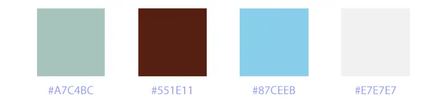
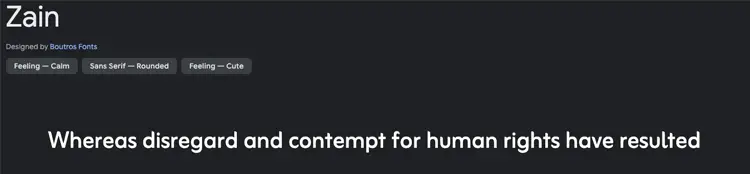
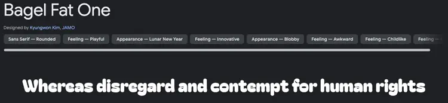
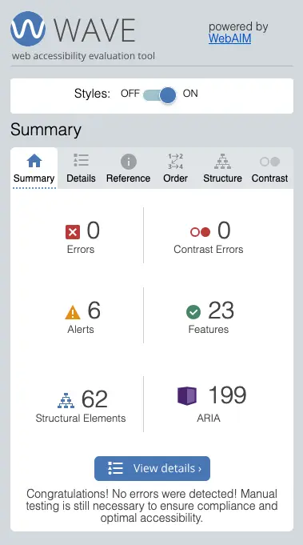
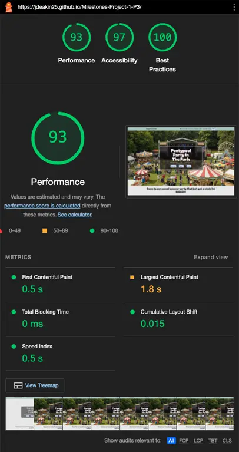
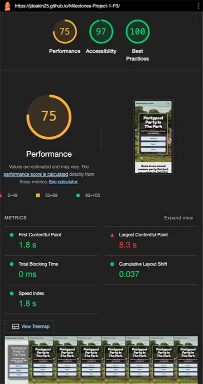

# Pontypool Party in The Park (P3)

<!-- Header image for mockups/landing page display -->

## ABOUT

Pontypool Party in the Park is an annual event held for the benefit of the local community, the purpose of this website is to promote the event and encourage engagement with potential attendees through registration opportunities and social media facilities. The site has been designed and built to be responsive on all screen sizes and various modern devices and is screen-reader compatible, with the intention of being accessible to all user groups.

## CONTENTS

###  1. [User Experience (UX)](#user-experience-ux)
  * [Site Owner Goals](#site-owner-goals)
  * [User Stories](#user-stories)

### 2. [Website Design](#website-design)
  * [Colour palettes](#colour-palettes)
  * [Typography](#typography)
  * [Images](#images)
  * [Wireframe Designs](#wireframe-designs)

### 3. [Features](#features)
  * [Site Navigation](#site-navigation)
  * [Calls to Action](#calls-to-action)
  * [Social Engagement](#social-engagement)

### 4. [Technologies](#technologies)
  * [Coding Languages](#coding-languages)
  * [Google Fonts](#google-fonts)
  * [Font Awesome](#font-awesome)
  
### 5. [Libraries](#libraries)
  * [Bootstrap Libraries](#bootstrap-libraries)

### 6. [Testing](#testing)
  * [User Stories](#user-stories-1) compared to User Experience
  * [Main Home Page](#main-home-page-tests) - nav, anchor and social links
  * [Success Pages](#success-pages-tests) - nav, anchor and social links
  * [Validation](#validation) - Use HTML and CSS validation for all site pages
  * [Lighthouse Reports](#lighthouse-reports) - via Google Chrome

### 7. [De-Bugging](#de-bugging)
  * [Developer Console Tools](#developer-console-tools) - journey exploring any potential bugs

### 8. [Deployment](#deployment)
  * [GITHUB Pages](#github-pages)

### 9. [Credits](#credits)
  * [Code](#code) - 3rd party library/code/snippet providers
  * [Media](#media) - images generated with Gemini for originality and to avoid copyright infringement/obtaining permissions.

### 10. [Acknowledgements](#acknowledgements)

## USER EXPERIENCE (UX)

### Site Owner Goals

Pontypool Community Council are the intended site owners and will expect clarity, assurance and delivery of the following criteria:

  - [Return on investment](#return-on-investment)
  - [Audience perception](#audience-perception)
  - [Increased turnover and revenue](#increased-turnover-and-revenue)
  - [Increased engagement with target audiences & driving efficient conversion rates](#increased-engagement-with-target-audiences--driving-efficient-conversion-rates)
  - [Increased site traffic](#increased-site-traffic)
  - [Culturally-appropriate content](#culturally-appropriate-content)
  - [Relevance to the local community](#relevance-to-the-local-community)
  - [Intuitive presentation](#intuitive-presentation)
  - [Technology choices](#technology-choices)

  ### Return on investment

  Through researching prior iterations of the annual Pontypool Party in The Park events and exploring Council Committee meeting agenda minutes I've learned that the Pontypool Community Council (PCC) budget around £30k for this event - being the most expensive event in the local community calendar. The PCC currently host a single page to promote the event on their website (https://pontypoolcc.gov.uk/community-information/annual-events/party-in-the-park/) and I've found this iteration to be ineffective in attracting and incentivising attendance. It serves the purpose of presenting the event's existence, clarifies the event date and cost, and has a supporting image gallery and a link to social media, but does not serve to incentivise and motivate attendance and engagement with the event. There is a lack of call-to-action points and aside from the option of viewing further details on social media, there is no option for potential attendees to register their interest directly with the site organisers and be kept up-to-date on event news efficiently.
  
  By designing and implementing a new site page that acknowledges the current shortfalls and prioritises engagement with the local community and incentivises attendance, we can work to achieve the following goals:

  - Increased attendance/footfall at the event.
  - Increased levels of spending - improving the local economy and visibility of local small businesses.
  - Increased exposure to the local area and the social/commercial opportunities available.
  - Increased awareness of charitable causes.
  - Promotion of the local community unique to Pontypool, bolstering social cohesion and engagement.
  - Promotion of local initiatives and talents.
  - Generate sponsorship opportunities.

  ### Audience Perception

  To ensure site visitors are provided with crucially positive impressions of the event and are motivated to attend, this project will work towards achieving the following key goals:

  - The site content is fun, simplistic and engaging.
  - The site is attractive and motivational to a range of different cultural and social demographics and is positively inclusive in nature.
  - The site uses modern design trends and is accessible to a wide range of screen sizes and device mediums.
  - The site offers interactivity that generates further engagement.
  - The site complies with all necessary ARIA accessibility requirements, including making use of semantic HTML elements, to aid compatiblilty with screen-reader technologies.

  ### Increased turnover and revenue

  Through identifying the criteria which are required to achieve the target of increased attendance and site-user conversion, I can reasonably speculate that increased footfall and attendance along with increased options for retail opportunities will all combine to promote spending at the event with event traders, including small businesses in the vicinity of the event not directly involved.

  ### Increased engagement with target audiences & driving efficient conversion rates

  By assessing the current shortfalls in engagement facilities within the current PCC event site and planning a suitable and progressive alternative facility that promotes engagement and drives site user conversion (by way of a registration form), I'm confident in achieving the site owner’s goals. Through the use of engaging, informative yet simple-to-assimilate information, and essential call-to-action points strategically placed intermittently throughout the page, this project site will encourage fruitful and useful site user engagement that will convert to tangible benefits for the event organisers, local community businesses and event attendees combined.

  ### Increased site traffic

  Through implementing efficient and validated HTML5 and CSS3 code that culminates in a well-designed site layout, which is functional and achieves all site user goals, I'm confident that site traffic will improve over the current standard. Efficient and validated code will support SEO ranking and accessibility for all user groups. Site validation will be achieved through the following tools:

  - W3C HTML Validation Service
  - W3C CSS Validation Service
  - Chrome Lighthouse Reports

  ### Culturally-appropriate content

  The proposed site will need to appeal to a diverse range of demographics that are identified through age, race, religion, gender and culture. The area of Pontypool is a relatively diverse environment with age groups across the spectrum, although there is a sizeable volume of retirement-age individuals present. There is a positive attitude towards socialising and due to economic constraints free events are always popular. Whilst I haven't identified any prominent religious groups in the vicinity, I'm aware of several local areas of worship, which implies a necessity to consider the cultural tone of the event and its promotion, ensuring sensitivity to all identifiable groups. 
  
  PCC also host an annual "Pride" event in the same location as Party in The Park and, through attendance last year, I learned of the importance of the LGBTQ+ community being recognised and treated with inclusivity and respect. Provided all content on the site is respectful and not discriminatory, promotes positivity and recognises the various demographics residing in the local area, I'm confident this approach to communication with the community will garner increased attendance and revenues, whilst fostering a positive environment and atmosphere.

  ### Relevance to the local community

  To ensure site visitors have a postive experience and gain a sense of familiarity to the event prior to attendance, I need to pay particular attention to include relevant information that helps promote the local area and ultimately drive attendance. 

  - Images need to exhibit the Pontypool Park environment and atmosphere.
  - Copy needs to reflect the cultural and social nuances of the surrounding population.
  - Essential information needs to be factual, accessible and easy to digest.
  
  ### Intuitive presentation

  The site will need to be intuitive and designed around the common expectations of general website visitors. To achieve this I will:

  - Ensure the site layout is logical in order, prioritising the most essential information first
  - Provide a fixed navigation bar to support site users and avoid laborious scrolling and poor user experience
  - Include relevant image content to support neighbouring copy
  - Any sections of information that are considerable in size need to be presented using specific elements which have been designed to help condense information and present detail  effectively

  ### Technology choices

  A core goal of this site to make use of the HTML5 and CSS3 coding languages proficiently, to ensure a fully functioning and effective resource is available to potential event attendees. 
  
  - Using HTML5 along with Bootstrap library components will help achieve formatting and layout choices. 
  - CSS3 styling will help coordinate the aesthetic of the site, promote consistency and ensure compatibility with different screen sizes.
  - Relevant Font Awesome iconography will help users understand and engage with content contained within the site.
  - Interactive form elements will drive user engagement with the event and the organisers.
  - Embedded resources from Google Maps will help provide site users with a valuable tool, useful in promoting event attendance.

### User Stories

- #### As a site visitor and member of the local community ...

  - I need a user-friendly design that is responsive and laid out effectively, so I can easily find the core information I require to make an informed decision on attendance.

  - I need clear and attractive images along with written content to support said images which accurately depict the environment and atmosphere of the event, so I can make a qualified decision on attendance.

  - I need to be able to quickly and easily find important event information such as date, location and cost, to be able to decide on attendance.

  - I want to learn about the entertainment acts and food / gift stalls that will be available during the event, to help decide on attendance and whether the event is suitable.

  - I'd like to be able to register minimal details with the event organisers to ensure I am kept up to date on any news and incentives related to the event, before attendance.

  - I'd appreciate information that confirms the availability of toilets, handwashing facilities and health professionals to ensure our attendance at the event is comfortable and safe. This information will help determine the suitability to attend this event.

  - I would like to be able to see answers to common questions an event attendee may ask before deciding on attendance.

  - I would like reassurance that the event is a 'safe space' and inclusive for all cultural and social demographics, is non-discriminatory and has resources available to support me should I need advice.

  - I would like to know about which charities are being supported by the event and how I may be able to contribute, to help support important initiatives and positive change.

  - I would like to know about what opportunities there are available to support the event in achieving it's financial targets, with the goal of promoting my business and gaining traction in the local areas of commerce.

## WEBSITE DESIGN

### Colour Palettes

The subject of this site will be the main park in Pontypool and will need images that convey this location well. As the site will involve images of a natural park area I thought a colour palette that complimented the colours naturally found in a park would be useful for this project.

The colour palette would need to be soft and subtle to contrast the deeper colours shown in the images of the event. The colour palette I chose is shown in the image below:

### Typography

This site needs to be attractive to a wide range of site users due to the audience base this event will be intended for. The event is intended to be fun and family-friendly and this needs to be conveyed through the typography choices.

I chose a simple and easy to read font for the main bulk of the text content - the Google Font "Zain", and to give particular attention to certain titles I chose a more unique font - the Google Font "Bagel Fat One"

Examples of these fonts can be seen in the images below:

As a fall-back to these font choices I included "sans-serif" attributes to ensure a good user experience if the Google Font CDN ever fails. Throughout the site I have made sure to follow semantic heading rules for all titles to ensure compliance with accessibility criteria and to follow best practices.

### Images

The main goal of this site is to attract potential attendees; to achieve this I have included plenty of supporting images that make specific reference to the location of the event, Pontypool Park. I've also referred to the key selling points of the event, like the entertainment and food and drink opportunities. Whilst this event is a real event I found that a lot of the imagery available online did not cover the variety of shots I needed to achieve the site goal and so I used Google Gemini to create my images. 

I made sure to include prompts relating to the event and location, to try and create an honest impression of the event that was not too misleading, despite being A.I generated. For the future development of this website, I plan to attend this event and take a wide selection of photographs that can then be used to replace the A.I generated images and offer site users a true reflection of this event.

All images have been provided with 'alt' attributes to assist with screen-reader technologies.

### Wireframe Designs

Due to the large target audience of site users, I need to make sure this site is simple to navigate and site users can quickly find the information they require to decide on attendance. Rather than create a complicated site structure with designated pages for the various sections and selling points of the site, I chose to have a single page that condensed the information into one space with multiple sections, ensuring site users are presented with all the information they need efficiently and with minimal page navigation required. 

By having a simple site structure the site will perform effectively as a platform to 'sell' the event to site users, as each section has been located to compound the value offered in the previous section, culminating in the opportunity to register as an event attendee and achieve another core function of the site. I have used semantic HTML elements where possible to help with accessibility and to follow best practices. 

Following the Registration section, if a site user is still undecided they have further supplemental event information available in the Travel, FAQs and Contact sections, that will hopefully alleviate any concerns or queries they may have and further encourage attendance. Finally, if a site user reaches the site footer and is still undecide I have included a basic site map that will navigate users to their chosen section.

I have included my initial wire-frame documents below:

  * [Mobile Wireframe Doc](docs/mobilewireframe.pdf)
  * [Tablet Wireframe Doc](docs/tabletwireframe.pdf)
  * [Desktop Wireframe Doc](docs/desktopwireframe.pdf)

During development I found several of my initial design elements were overly complicated and difficult to achieve, mainly the masonry image layout within the main Entertainment section. After exploring various ways of achieving the initial design I then decided to save time and use a more simplistic design for this section. Another change in the layout came with the volume of images intended to be used, as I found the site became too 'busy' and distracting, so the overall quantity of images has been reduced, particularly in the Food & Drink and Gifts & Stalls areas.

## FEATURES

A core goal of the site is user engagement with the event organisers via registering for event updates, but also through social media where site users can learn about the key selling points of the event, such as the entertainment and retail options. The site includes a simple and effective lead capture form requiring only first and last names, an email address for correspondence, and a distinction on what type of attendee the user is registering as. By including a drop-down element within the form and asking site users to make this declaration, it ensures data is accurate and the correct marketing is received by the intended audience. The declaration of attendee type also benefits specifically performers and vendors, as they are clearly identifiable to the organisers and will be useful for future event planning purposes. 

When users successfully complete a form they are greeted with a confirmation message via redirection to a specific "Success" page. Within these confirmation pages I've included necessary links for users to redirect back to the site home page, ensuring site users do not get lost. The confirmation pages also include the expected navigation and footer elements, to support consistency across the site structure but also to help users navigate effectively to their next destination within the site.

The site also includes a standard contact form to support site users with specific questions and queries, but this form also asks users to specify the context of their form submission, in relation to niche activities, like sponsorship or charity support. This addition to the form will support the user experience and help event organisers respond correctly and effectively to their intended audiences. In addition to these forms, I’ve included all relevant social media links to their respective pages, and any that were not available now link to the main social media provider home page.

As an added feature to support the user experience and encourage event attendance an IFrame containing a Google map of the event location is available in the Travel section, along with links to useful external travel planning facilities. 

### Site Navigation

The site employs a simple navigation structure that contains links to the main sections and areas of the home page. When viewed on smaller devices the main navigation bar will condense into a burger icon that displays a drop-down menu when activated. 

Through studying the Code Institute walkthrough project “Boardwalk Games” I was introduced to a small script of JS that causes the burger menu list to collapse when a link is activated, as the standard Bootstrap navbar code does not offer this function. I have included this script within this site to offer a more professional experience to site users than the standard Bootstrap code allows for.

### Calls To Action

Various CTAs (calls to action) intersect the core sections, prompting users who are ready to head straight to the Registration section. I chose to include several instances across the main site page so as to remind site visitors of a core function of the site and to help achieve the site owner goal of increased audience engagement.

### Social Engagement

All performers and suppliers cards and tab panels include relevant social media links, to help site users engage with the key selling points of the event. By providing links to this added content it will help site visitors to make informed choices about the suitability of the event and whether to attend or not. Links to the event organiser's social media pages are also present where possible to support site user engagement with the event.

## TECHNOLOGIES

### Coding Languages

This site employs HTML5 coding throughout, with a supporting CSS3 style sheet to assist with design choices not possible through use of the Bootstrap Libraries. For the purposes of achieving responsivity across screen sizes I have included Media Queries within the style sheet where necessary. The CSS style sheet was also supported with auto-prefixing via the GitHub tool listed in the Credits section of this document.

### Google Fonts

The site fonts have been provided via the Google Fonts, with fall-back attributes present.

### Font Awesome

To support the user experience I made use of various relevant Font Awesome icons, helping the user to visualise the subject matter they are viewing.

## LIBRARIES

### Bootstrap Libraries

I've made extensive use of the current Bootstrap Library (5.3) to assist with layout, spacing and components within the site. Due to the volume of information in the Food & Drink and Gifts & Stalls areas I chose to use the Tabs Bootstrap element. This made the user experience better when browsing all of the various details available on the supplier tab panels. I also made use of the Accordion Bootstrap element to help condense the content within the FAQs section, to again help create a positive site user experience.

## TESTING

During the development process I made sure to refer back to my user stories and owner goals, ensuring the purpose of the site was in focus at all times. I made sure to review user stories and ensure any supporting facilities in place, such as anchor links and form submission buttons were all functioning as intended. Several friends and family members were invited to test the site and no issues were raised, except for preferences around the colour palette, which were taken into consideration. 

When testing the forms all performed as expected during desktop device testing, however when testing on mobile devices using the Firefox browser the form does not prompt users to enter their details when submitting an empty form. Whilst the form does not submit with empty fields as intended, the issue of not prompting the user formally to complete all fields will be addressed in future development.

Browser compatibility tests were carried out using and showed no issues or errors:

- Chrome
- Firefox
- Safari
- DuckDuckGo

When assessing the site against formal criteria I have achieved the following results detailed in the tables below:

### User Stories

| User Story                                                                                                                                                                                                                                                               | Aim                                                                                                                                                                                                                                                                                                                    | Outcome                                                                                                                                                                                                                                                                                                                                  | Result                                              |
| ------------------------------------------------------------------------------------------------------------------------------------------------------------------------------------------------------------------------------------------------------------------------ | ---------------------------------------------------------------------------------------------------------------------------------------------------------------------------------------------------------------------------------------------------------------------------------------------------------------------- | ---------------------------------------------------------------------------------------------------------------------------------------------------------------------------------------------------------------------------------------------------------------------------------------------------------------------------------------- | --------------------------------------------------- |
| I need a user-friendly design that is responsive and laid out effectively, so I can easily find the core information I require to make an informed decision on attendance.                                                                                         | The website is responsive and laid out intuitively, with core information presented as a priority                                                                                                                                                                                                                   | On loading the site, the pages are responsive to all screen sizes and vital information about the event is presented in the first Hero section. Subsequent sections follow a priority based on what aspects of the event would draw in attendees most, being Entertainment, then Food & Drink, then Gifts and Stalls etc. | PASS                                                |
| I need clear and attractive images along with written content to support said images which accurately depict the environment and atmosphere of the event, so I can make a qualified decision on attendance.                                                        | Images are reflective of the event and relevant sections/areas include supporting text to accompany images                                                                                                                                                                                                          | All images relate directly to their location on the site and their accompanying text. Images have been produced to be high quality whilst using appropriate compression via the WebP file format to help with loading times.                                                                                                    | PASS                                                |
| I need to be able to quickly and easily find important event information such as date, location and cost, to be able to decide on attendance.                                                                                                                         | Important event information is presented immediately upon site load, and is supported with an intuitive navigation bar that is fixed, helping users access important information within the 3-click rule                                                                                                         | The main Hero section contains important event information and is the first section that is presented to site users. The navigation bar is fixed and allows users to browse to key areas on the page with ease.                                                                                                                 | PASS                                                |
| I want to learn about the entertainment acts and food/gift stalls that will be available during the event, to help decide on attendance and whether the event is suitable.                                                                                         | Motivational text and image content regarding Entertainment and Food & Drink / Gifts & Stalls are included in specific sections, linked to by the main nav bar                                                                                                                                                   | Entertainment and Food & Drink / Gifts & Stalls sections are present and supported with attractive images and relevant text. Links to performer/supplier email and social media are also present to provide users with further information about these core aspects of the event.                                            | PASS                                                |
| I'd like to be able to register minimal details with the event organisers to ensure I am kept up to date on any news and incentives related to the event, before attendance.                                                                                       | Registration section is included and only requires basic information, such as name, email address and attendee type. All fields in this form are required for consistency of data capture. Upon submission site users are greeted with a Success page confirming a successful submission of their details. | The registration form contains only First Name, Last Name, Email and Attendee type fields, all are required, and the user is redirected to the Success page upon successful submission.                                                                                                                                            | PASS                                                |
| I'd appreciate information that confirms the availability of toilets, handwashing facilities and health professionals to ensure our attendance at the event is comfortable and safe. This information will help determine the suitability to attend this event. | The facilities section is included, comprising of motivational text and image content that relates to the subjects discussed in this section, reassuring site users of the event's comfort and safety provisions.                                                                                                | The facilities section is present and supported with attractive images and motivational text, providing necessary reassurances to site users.                                                                                                                                                                                      | PASS                                                |
| I would like to be able to see answers to common questions an event attendee may ask before deciding on attendance.                                                                                                                                                   | FAQs section is included, comprising of descriptive and reassuring text content that addresses common queries and concerns potential event attendees may have.                                                                                                                                                   | FAQ section is present and includes necessary text content to support and reassure potential attendees of queries and concerns they may have.                                                                                                                                                                                      | PASS                                                |
| I would like reassurance that the event is a 'safe space' and inclusive for all cultural and social demographics, is non-discriminatory and has resources available to support me should I need advice.                                                            | Information is provided that promotes the event's inclusive attitude and reassures potential attendees of the resources and support available at the event.                                                                                                                                                      | An Inclusivity panel is present within the FAQs section, providing the reassurance site users are looking for and also detailing resources and support available at the event.                                                                                                                                                     | PASS                                                |
| I would like to know about which charities are being supported by the event and how I may be able to contribute, to help support important initiatives and positive change.                                                                                        | Information is provided that details the charity support offered by the event and explains how event attendees can offer their own support.                                                                                                                                                                         | A Charities panel is present within the FAQs section, offering details on how the event supports local charities and offers information for event attendees to offer their own support.                                                                                                                                            | PASS (\* specific charities were not referenced) |
| I would like to know about what opportunities there are available to support the event in achieving its financial targets, with the goal of promoting my business and gaining traction in the local areas of commerce.                                          | Information is provided that details and promotes the opportunities available for businesses to offer sponsorship to the event.                                                                                                                                                                                     | A Sponsorship panel is present within the FAQs section, offering details and incentives for businesses to offer sponsorship to the event.                                                                                                                                                                                          | PASS                                                |

### Main Home Page Tests

#### NAVBAR

| Location / Feature | Aim                                                         | Test                    | Outcome                            | Result |
| ------------------ | ----------------------------------------------------------- | ----------------------- | ---------------------------------- | ------ |
| Navbar             | Site title redirects users to home page                     | Tap site title          | Navigates to home page             | PASS   |
|                    | HOME link redirects users to Hero section                   | Tap HOME link           | Navigates to Hero section          | PASS   |
|                    | ENTERTAINMENT link redirects users to Entertainment section | Tap ENTERTAINMENT link  | Navigates to Entertainment section | PASS   |
|                    | FOOD & DRINK link redirects users to Food & Drink area      | Tap FOOD & DRINK link   | Navigates to Food & Drink area     | PASS   |
|                    | GIFTS & STALLS link redirects users to Gifts & Stalls area  | Tap GIFTS & STALLS link | Navigates to Gifts & Stalls area   | PASS   |
|                    | FACILITIES link redirects users to Facilities section       | Tap FACILITIES link     | Navigates to Facilities section    | PASS   |
|                    | TRAVEL link redirects users to Travel section               | Tap FACILITIES link     | Navigates to Travel section        | PASS   |
|                    | FAQs link redirects users to FAQs area                      | Tap FAQs link           | Navigates to FAQs area             | PASS   |
|                    | CONTACT link redirects users to Contact Us area             | Tap CONTACT link        | Navigates to Contact Us area       | PASS   |
|                    | REGISTER button redirects users to Registration section     | Tap REGISTER button     | Navigates to Registration section  | PASS   |  

#### HERO Section  

| Location / Feature | Aim                                                       | Test                 | Outcome                            | Result |
| ------------------ | --------------------------------------------------------- | -------------------- | ---------------------------------- | ------ |
| Hero Section       | WHAT'S ON button redirects users to Entertainment section | Tap WHAT'S ON button | Navigates to Entertainment section | PASS   |
|                    | REGISTER button redirects users to Registration section   | Tap REGISTER button  | Navigates to Registration section  | PASS   |
|                    | CONTACT button redirects users to Contact area            | Tap CONTACT button   | Navigates to Contact area          | PASS   |

#### INTRO Section  

| Location / Feature | Aim                                                                         | Test                                  | Outcome                             | Result |
| ------------------ | --------------------------------------------------------------------------- | ------------------------------------- | ----------------------------------- | ------ |
| Intro Section      | EXPLORE OUR ENTERTAINMENT button redirects users to Entertainment section   | Tap EXPLORE OUR ENTERTAINMENT button  | Navigates to Entertainment section  | PASS   |
|                    | EXPLORE OUR FOOD & DRINK button redirects users to Food & Drink section     | Tap EXPLORE OUR FOOD & DRINK button   | Navigates to Food & Drink section   | PASS   |
|                    | EXPLORE OUR GIFTS & STALLS button redirects users to Gifts & Stalls section | Tap EXPLORE OUR GIFTS & STALLS button | Navigates to Gifts & Stalls section | PASS   |
|                    | EXPLORE OUR FACILITIES button redirects users to Facilities section         | Tap FACILITIES button                 | Navigates to Facilities section     | PASS   |  

#### CTA - Social Media

| Location / Feature | Aim                                                              | Test               | Outcome                                                | Result |
| ------------------ | ---------------------------------------------------------------- | ------------------ | ------------------------------------------------------ | ------ |
| CTA - Social Media | Facebook Icon links to organiser's Facebook page in separate tab | Tap Facebook Icon  | Navigates to organiser's Facebook page in separate tab | PASS   |
|                    | Twitter/X Icon links to Twitter/X page in separate tab           | Tap Twitter/X Icon | Navigates to Twitter/X page in separate tab            | PASS   |
|                    | Instagram Icon links to Instagram page in separate tab           | Tap Instagram Icon | Navigates to Instagram page in separate tab            | PASS   |

#### ENTERTAINMENT Section  

| Location / Feature    | Aim                                                                                    | Test               | Outcome                                                 | Result |
| --------------------- | -------------------------------------------------------------------------------------- | ------------------ | ------------------------------------------------------- | ------ |
| Entertainment Section | GLC Card Facebook Icon links to performer's Facebook page in separate tab              | Tap Facebook Icon  | Navigates to performer's Facebook page in separate tab  | PASS   |
|                       | GLC Card Twitter/X Icon links to performer's Twitter/X page in separate tab            | Tap Twitter/X Icon | Navigates to performer's Twitter/X page in separate tab | PASS   |
|                       | GLC Card Instagram Icon links to performer's Instagram page in separate tab            | Tap Instagram Icon | Navigates to performer's Instagram page in separate tab | PASS   |
|                       | GLC Card YouTube Icon links to performer's YouTube page in separate tab                | Tap YouTube Icon   | Navigates to performer's YouTube page in separate tab   | PASS   |
|                       |                                                                                        |                    |                                                         |        |
|                       | Stereophonics Card Facebook Icon links to performer's Facebook page in separate tab    | Tap Facebook Icon  | Navigates to performer's Facebook page in separate tab  | PASS   |
|                       | Stereophonics Card Twitter/X Icon links to performer's Twitter/X page in separate tab  | Tap Twitter/X Icon | Navigates to performer's Twitter/X page in separate tab | PASS   |
|                       | Stereophonics Card Instagram Icon links to performer's Instagram page in separate tab  | Tap Instagram Icon | Navigates to performer's Instagram page in separate tab | PASS   |
|                       | Stereophonics Card YouTube Icon links to performer's YouTube page in separate tab      | Tap YouTube Icon   | Navigates to performer's YouTube page in separate tab   | PASS   |
|                       |                                                                                        |                    |                                                         |        |
|                       | Cerys Matthews Card Facebook Icon links to performer's Facebook page in separate tab   | Tap Facebook Icon  | Navigates to performer's Facebook page in separate tab  | PASS   |
|                       | Cerys Matthews Card Twitter/X Icon links to performer's Twitter/X page in separate tab | Tap Twitter/X Icon | Navigates to performer's Twitter/X page in separate tab | PASS   |
|                       | Cerys Matthews Card Instagram Icon links to performer's Instagram page in separate tab | Tap Instagram Icon | Navigates to performer's Instagram page in separate tab | PASS   |
|                       | Cerys Matthews Card YouTube Icon links to performer's YouTube page in separate tab     | Tap YouTube Icon   | Navigates to performer's YouTube page in separate tab   | PASS   |
|                       |                                                                                        |                    |                                                         |        |
|                       | Ruth Jones Card Facebook Icon links to performer's Facebook page in separate tab       | Tap Facebook Icon  | Navigates to performer's Facebook page in separate tab  | PASS   |
|                       | Ruth Jones Card Twitter/X Icon links to performer's Twitter/X page in separate tab     | Tap Twitter/X Icon | Navigates to performer's Twitter/X page in separate tab | PASS   |
|                       | Ruth Jones Card Instagram Icon links to performer's Instagram page in separate tab     | Tap Instagram Icon | Navigates to performer's Instagram page in separate tab | PASS   |

#### CTA - Register as attendee

| Location / Feature         | Aim                                                     | Test                | Outcome                           | Result |
| -------------------------- | ------------------------------------------------------- | ------------------- | --------------------------------- | ------ |
| CTA - Register as attendee | REGISTER button redirects users to Registration section | Tap REGISTER button | Navigates to Registration section | PASS   |

#### FOOD & DRINK Area

| Location / Feature   | Aim                                                                                 | Test                     | Outcome                                               | Result |
| -------------------- | ----------------------------------------------------------------------------------- | ------------------------ | ----------------------------------------------------- | ------ |
| Food & Drink Area    | Ponty Pies tab opens Ponty Pies tab panel                                           | Tap Ponty Pies tab       | Opens Ponty Pies tab panel                            | PASS   |
|                      | Ponty Pies Tab Email Icon opens new email message window                            | Tap Email Icon           | Opens new email message window                        | PASS   |
|                      | Ponty Pies Tab Facebook Icon links to supplier's Facebook page in separate tab      | Tap Facebook Icon        | Navigates to supplier's Facebook page in separate tab | PASS   |
|                      | Ponty Pies Tab Twitter/X Icon links to Twitter/X in separate tab                    | Tap Twitter/X Icon       | Navigates to Twitter/X in separate tab                | PASS   |
|                      | Ponty Pies Tab Instagram Icon links to Instagram in separate tab                    | Tap Instagram Icon       | Navigates to Instagram in separate tab                | PASS   |
|                      | Ponty Pies Tab YouTube Icon links to YouTube in separate tab                        | Tap YouTube Icon         | Navigates to YouTube in separate tab                  | PASS   |
|                      | Ponty Pies DOWNLOAD MENU button opens supplier menu in separate tab                 | Tap DOWNLOAD MENU button | Opens supplier menu in separate tab                   | PASS   |
|                      |                                                                                     |                          |                                                       |        |
|                      | Bangin' Burgers tab opens Bangin' Burgers tab panel                                 | Tap Bangin' Burgers tab  | Opens Bangin' Burgers tab panel                       | PASS   |
|                      | Bangin' Burgers Tab Email Icon opens new email message window                       | Tap Email Icon           | Opens new email message window                        | PASS   |
|                      | Bangin' Burgers Tab Facebook Icon links to supplier's Facebook page in separate tab | Tap Facebook Icon        | Navigates to supplier's Facebook page in separate tab | PASS   |
|                      | Bangin' Burgers Tab Twitter/X Icon links to Twitter/X in separate tab               | Tap Twitter/X Icon       | Navigates to Twitter/X in separate tab                | PASS   |
|                      | Bangin' Burgers Tab Instagram Icon links to Instagram in separate tab               | Tap Instagram Icon       | Navigates to Instagram in separate tab                | PASS   |
|                      | Bangin' Burgers Tab YouTube Icon links to YouTube in separate tab                   | Tap YouTube Icon         | Navigates to YouTube in separate tab                  | PASS   |
|                      | Bangin' Burgers DOWNLOAD MENU button opens supplier menu in separate tab            | Tap DOWNLOAD MENU button | Opens supplier menu in separate tab                   | PASS   |
|                      |                                                                                     |                          |                                                       |        |
|                      | Cheers Beers tab opens Cheers Beers tab panel                                       | Tap Cheers Beers tab     | Opens Cheers Beers tab panel                          | PASS   |
|                      | Cheers Beers Tab Email Icon opens new email message window                          | Tap Email Icon           | Opens new email message window                        | PASS   |
|                      | Cheers Beers Tab Facebook Icon links to supplier's Facebook page in separate tab    | Tap Facebook Icon        | Navigates to supplier's Facebook page in separate tab | PASS   |
|                      | Cheers Beers Tab Twitter/X Icon links to Twitter/X in separate tab                  | Tap Twitter/X Icon       | Navigates to Twitter/X in separate tab                | PASS   |
|                      | Cheers Beers Tab Instagram Icon links to Instagram in separate tab                  | Tap Instagram Icon       | Navigates to Instagram in separate tab                | PASS   |
|                      | Cheers Beers Tab YouTube Icon links to YouTube in separate tab                      | Tap YouTube Icon         | Navigates to YouTube in separate tab                  | PASS   |
|                      | Cheers Beers DOWNLOAD MENU button opens supplier menu in separate tab               | Tap DOWNLOAD MENU button | Opens supplier menu in separate tab                   | PASS   |

#### GIFTS & STALLS Area

| Location / Feature     | Aim                                                                                | Test                   | Outcome                                               | Result |
| ---------------------- | ---------------------------------------------------------------------------------- | ---------------------- | ----------------------------------------------------- | ------ |
| Gifts & Stalls Area    | Gorgeous Gifts tab opens Gorgeous Gifts tab panel                                  | Tap Gorgeous Gifts tab | Opens Gorgeous Gifts tab panel                        | PASS   |
|                        | Gorgeous Gifts Tab Email Icon opens new email message window                       | Tap Email Icon         | Opens new email message window                        | PASS   |
|                        | Gorgeous Gifts Tab Facebook Icon links to supplier's Facebook page in separate tab | Tap Facebook Icon      | Navigates to supplier's Facebook page in separate tab | PASS   |
|                        | Gorgeous Gifts Tab Twitter/X Icon links to Twitter/X in separate tab               | Tap Twitter/X Icon     | Navigates to Twitter/X in separate tab                | PASS   |
|                        | Gorgeous Gifts Tab Instagram Icon links to Instagram in separate tab               | Tap Instagram Icon     | Navigates to Instagram in separate tab                | PASS   |
|                        | Gorgeous Gifts Tab YouTube Icon links to YouTube in separate tab                   | Tap YouTube Icon       | Navigates to YouTube in separate tab                  | PASS   |
|                        |                                                                                    |                        |                                                       |        |
|                        | LLL at Home tab opens LLL at Home tab panel                                        | Tap LLL at Home tab    | Opens LLL at Home tab panel                           | PASS   |
|                        | LLL at Home Tab Email Icon opens new email message window                          | Tap Email Icon         | Opens new email message window                        | PASS   |
|                        | LLL at Home Tab Facebook Icon links to supplier's Facebook page in separate tab    | Tap Facebook Icon      | Navigates to supplier's Facebook page in separate tab | PASS   |
|                        | LLL at Home Tab Twitter/X Icon links to Twitter/X in separate tab                  | Tap Twitter/X Icon     | Navigates to Twitter/X in separate tab                | PASS   |
|                        | LLL at Home Tab Instagram Icon links to Instagram in separate tab                  | Tap Instagram Icon     | Navigates to Instagram in separate tab                | PASS   |
|                        | LLL at Home Tab YouTube Icon links to YouTube in separate tab                      | Tap YouTube Icon       | Navigates to YouTube in separate tab                  | PASS   |
|                        |                                                                                    |                        |                                                       |        |
|                        | Noam's Garden tab opens Noam's Garden tab panel                                    | Tap Noam's Garden tab  | Opens Noam's Garden tab panel                         | PASS   |
|                        | Noam's Garden Tab Email Icon opens new email message window                        | Tap Email Icon         | Opens new email message window                        | PASS   |
|                        | Noam's Garden Tab Facebook Icon links to supplier's Facebook page in separate tab  | Tap Facebook Icon      | Navigates to supplier's Facebook page in separate tab | PASS   |
|                        | Noam's Garden Tab Twitter/X Icon links to Twitter/X in separate tab                | Tap Twitter/X Icon     | Navigates to Twitter/X in separate tab                | PASS   |
|                        | Noam's Garden Tab Instagram Icon links to Instagram in separate tab                | Tap Instagram Icon     | Navigates to Instagram in separate tab                | PASS   |
|                        | Noam's Garden Tab YouTube Icon links to YouTube in separate tab                    | Tap YouTube Icon       | Navigates to YouTube in separate tab                  | PASS   |

#### CTA - Register as supplier

| Location / Feature         | Aim                                                     | Test                | Outcome                           | Result |
| -------------------------- | ------------------------------------------------------- | ------------------- | --------------------------------- | ------ |
| CTA - Register as supplier | REGISTER button redirects users to Registration section | Tap REGISTER button | Navigates to Registration section | PASS   |

#### REGISTRATION Form

| Location / Feature | Aim                                                                | Test                                  | Outcome                                      | Result |
| ------------------ | ------------------------------------------------------------------ | ------------------------------------- | -------------------------------------------- | ------ |
| Registration Form  | First Name field is required and expects text content              | Submit form without First Name        | Form does not submit                         | PASS   |
|                    | Last Name field is required and expects text content               | Submit form without Last Name         | Form does not submit                         | PASS   |
|                    | Email address field is requried and expects email content          | Submit form without Email             | Form does not submit                         | PASS   |
|                    |                                                                    | Submit form without @ symbol          | Form does not submit                         | PASS   |
|                    | Register As field is required and expects an option to be selected | Submit form without selecting option  | Form does not submit                         | PASS   |
|                    | Completed form redirects user to Success page                      | Submit form will all fields completed | Form submits, redirects user to Success page | PASS   |

#### TRAVEL Section

| Location / Feature | Aim                                                                                              | Test                                          | Outcome                                                | Result |
| ------------------ | ------------------------------------------------------------------------------------------------ | --------------------------------------------- | ------------------------------------------------------ | ------ |
| Travel Section     | "Route Plan with Google Maps" link opens Google Maps route planner in separate tab               | Tab "Route Plan with Google Maps" link        | Opens Google Maps route planner in separate tab        | PASS   |
|                    | "Route Plan with Stagecoach Torfaen" link opens Stagecoach Torfaen route planner in separate tab | Tab "Route Plan with Stagecoach Torfaen" link | Opens Stagecoach Torfaen route planner in separate tab | PASS   |
|                    | "Route Plan with The Trainline" link opens The Trainline route planner in separate tab           | Tab "Route Plan with The Trainline" link      | Opens The Trainline route planner in separate tab      | PASS   |

#### FAQs Area

| Location / Feature | Aim                                                              | Test                     | Outcome                                                | Result |
| ------------------ | ---------------------------------------------------------------- | ------------------------ | ------------------------------------------------------ | ------ |
| FAQs area          | ACCESSIBILITY accordion item opens Accessibility panel           | Tab ACCESSIBILITY item   | Opens Accessibility panel                              | PASS   |
|                    | INCLUSIVITY accordion item opens Inclusivity panel               | Tab INCLUSIVITY item     | Opens Inclusivity panel                                | PASS   |
|                    | NEURODIVERGENCE accordion item opens Neurodivergence panel       | Tab NEURODIVERGENCE item | Opens Neurodivergence panel                            | PASS   |
|                    | CHILDREN'S ZONE accordion item opens Children's Zone panel       | Tab CHILDREN'S ZONE item | Opens Children's Zone panel                            | PASS   |
|                    | CHARITY SUPPORT accordion item opens Charity Support panel       | Tab CHARITY SUPPORT item | Opens Charity Support panel                            | PASS   |
|                    | SPONSORSHIP accordion item opens Sponsorship panel               | Tab SPONSORSHIP item     | Opens Sponsorship panel                                | PASS   |
|                    |                                                                  |                          |                                                        |        |
|                    | Facebook Icon links to organiser's Facebook page in separate tab | Tap Facebook Icon        | Navigates to organiser's Facebook page in separate tab | PASS   |
|                    | Twitter/X Icon links to Twitter/X page in separate tab           | Tap Twitter/X Icon       | Navigates to Twitter/X page in separate tab            | PASS   |
|                    | Instagram Icon links to Instagram page in separate tab           | Tap Instagram Icon       | Navigates to Instagram page in separate tab            | PASS   |

#### CONTACT US Area

| Location / Feature | Aim                                                                 | Test                                  | Outcome                                      | Result |
| ------------------ | ------------------------------------------------------------------- | ------------------------------------- | -------------------------------------------- | ------ |
| Contact Form       | First Name field is required and expects text content               | Submit form without First Name        | Form does not submit                         | PASS   |
|                    | Last Name field is required and expects text content                | Submit form without Last Name         | Form does not submit                         | PASS   |
|                    | Email address field is requried and expects email content           | Submit form without Email             | Form does not submit                         | PASS   |
|                    |                                                                     | Submit form without @ symbol          | Form does not submit                         | PASS   |
|                    | Enquiry Type field is required and expects an option to be selected | Submit form without selecting option  | Form does not submit                         | PASS   |
|                    | Leave a message here field is required and expects text content     | Submit form without Message entry     | Form does not submit                         | PASS   |
|                    | Completed form redirects user to Success page                       | Submit form will all fields completed | Form submits, redirects user to Success page | PASS   |

#### FOOTER Section

| Location / Feature | Aim                                                                        | Test                                 | Outcome                                              | Result |
| ------------------ | -------------------------------------------------------------------------- | ------------------------------------ | ---------------------------------------------------- | ------ |
| Footer             | Telephone number link opens new phonecall window with number pre-populated | Tap Telephone number                 | Opens new phonecall window with number pre-populated | PASS   |
|                    | HOME anchor link re-directs to top Hero section                            | Tap HOME link                        | Redirects to top Hero section                        | PASS   |
|                    | ENTERTAINMENT anchor link re-directs to Entertainment section              | Tap ENTERTAINMENT link               | Redirects to Entertainment section                   | PASS   |
|                    | FOOD & DRINK anchor link re-directs to Food & Drink area                   | Tap FOOD & DRINK link                | Redirects to Food & Drink area                       | PASS   |
|                    | GIFTS & STALLS anchor link re-directs to Gifts & Stalls area               | Tap GIFTS & STALLS link              | Redirects to Gifts & Stalls area                     | PASS   |
|                    | FACILITIES anchor link re-directs to Facilities section                    | Tap FACILITIES link                  | Redirects to Facilities section                      | PASS   |
|                    | REGISTER anchor link re-directs to Registration section                    | Tap REGISTER link                    | Redirects to Registration section                    | PASS   |
|                    | TRAVEL anchor link re-directs to Travel section                            | Tap TRAVEL link                      | Redirects to Travel section                          | PASS   |
|                    | FAQS anchor link re-directs to FAQs area                                   | Tap FAQs link                        | Redirects to FAQs area                               | PASS   |
|                    | CONTACT anchor link re-directs to Contact Us area                          | Tap CONTACT link                     | Redirects to Contact Us area                         | PASS   |
|                    |                                                                            |                                      |                                                      |        |
|                    | "Download Poster" button links to Poster doc in separate tab               | Tab "Download Poster"                | Opens Poster doc in separate tab                     | PASS   |
|                    | "Download Flyer" button links to Flyer doc in separate tab                 | Tab "Download Flyer"                 | Opens Flyer doc in separate tab                      | PASS   |
|                    | "Download Event Map" button links to Event Map doc in separate tab         | Tab "Download Event Map"             | Opens Event Map doc in separate tab                  | PASS   |
|                    |                                                                            |                                      |                                                      |        |
|                    | Pontypool Community Council logo opens PCC website in separate tab         | Tap Pontypool Community Council logo | Opens PCC website in separate tab                    | PASS   |
|                    | Torfaen Borough Council logo opens TBC website in separate tab             | Tap Torfaen Borough Council logo     | Opens TBC website in separate tab                    | PASS   |

### Success Pages Tests

#### NAVBAR

| Location / Feature | Aim                                                                    | Test                    | Outcome                                       | Result |
| ------------------ | ---------------------------------------------------------------------- | ----------------------- | --------------------------------------------- | ------ |
| Navbar Links       | Site title redirects users to home page                                | Tap site title          | Navigates to home page                        | PASS   |
|                    | HOME link redirects users to Home page, Hero section                   | Tap HOME link           | Navigates to Home page, Hero section          | PASS   |
|                    | ENTERTAINMENT link redirects users to Home page, Entertainment section | Tap ENTERTAINMENT link  | Navigates to Home page, Entertainment section | PASS   |
|                    | FOOD & DRINK link redirects users to Home page, Food & Drink area      | Tap FOOD & DRINK link   | Navigates to Home page, Food & Drink area     | PASS   |
|                    | GIFTS & STALLS link redirects users to Home page, Gifts & Stalls area  | Tap GIFTS & STALLS link | Navigates to Home page, Gifts & Stalls area   | PASS   |
|                    | FACILITIES link redirects users to Home page, Facilities section       | Tap FACILITIES link     | Navigates to Home page, Facilities section    | PASS   |
|                    | TRAVEL link redirects users to Home page, Travel section               | Tap FACILITIES link     | Navigates to Home page, Travel section        | PASS   |
|                    | FAQs link redirects users to Home page, FAQs area                      | Tap FAQs link           | Navigates to Home page, FAQs area             | PASS   |
|                    | CONTACT link redirects users to Home page, Contact Us area             | Tap CONTACT link        | Navigates to Home page, Contact Us area       | PASS   |
|                    | REGISTER button redirects users to Home page, Registration section     | Tap REGISTER button     | Navigates to Home page, Registration section  | PASS   |

#### MAIN Section

| Location / Feature | Aim                                                           | Test                      | Outcome                      | Result |
| ------------------ | ------------------------------------------------------------- | ------------------------- | ---------------------------- | ------ |
| Main Section       | "Return to the home page" button redirects users to Home page | Tab "Return to home page" | Redirects users to Home page | PASS   |

#### FOOTER Section

| Location / Feature | Aim                                                                        | Test                                 | Outcome                                              | Result |
| ------------------ | -------------------------------------------------------------------------- | ------------------------------------ | ---------------------------------------------------- | ------ |
| Footer             | Telephone number link opens new phonecall window with number pre-populated | Tap Telephone number                 | Opens new phonecall window with number pre-populated | PASS   |
|                    | HOME anchor link re-directs to Home page, top Hero section                 | Tap HOME link                        | Redirects to Home page, top Hero section             | PASS   |
|                    | ENTERTAINMENT anchor link re-directs to Home page, Entertainment section   | Tap ENTERTAINMENT link               | Redirects to Home page, Entertainment section        | PASS   |
|                    | FOOD & DRINK anchor link re-directs to Home page, Food & Drink area        | Tap FOOD & DRINK link                | Redirects to Home page, Food & Drink area            | PASS   |
|                    | GIFTS & STALLS anchor link re-directs to Home page, Gifts & Stalls area    | Tap GIFTS & STALLS link              | Redirects to Home page, Gifts & Stalls area          | PASS   |
|                    | FACILITIES anchor link re-directs to Home page, Facilities section         | Tap FACILITIES link                  | Redirects to Home page, Facilities section           | PASS   |
|                    | REGISTER anchor link re-directs to Home page, Registration section         | Tap REGISTER link                    | Redirects to Home page, Registration section         | PASS   |
|                    | TRAVEL anchor link re-directs to Home page, Travel section                 | Tap TRAVEL link                      | Redirects to Home page, Travel section               | PASS   |
|                    | FAQS anchor link re-directs to Home page, FAQs area                        | Tap FAQs link                        | Redirects to Home page, FAQs area                    | PASS   |
|                    | CONTACT anchor link re-directs to Home page, Contact Us area               | Tap CONTACT link                     | Redirects to Home page, Contact Us area              | PASS   |
|                    |                                                                            |                                      |                                                      |        |
|                    | "Download Poster" button links to Poster doc in separate tab               | Tab "Download Poster"                | Opens Poster doc in separate tab                     | PASS   |
|                    | "Download Flyer" button links to Flyer doc in separate tab                 | Tab "Download Flyer"                 | Opens Flyer doc in separate tab                      | PASS   |
|                    | "Download Event Map" button links to Event Map doc in separate tab         | Tab "Download Event Map"             | Opens Event Map doc in separate tab                  | PASS   |
|                    |                                                                            |                                      |                                                      |        |
|                    | Pontypool Community Council logo opens PCC website in separate tab         | Tap Pontypool Community Council logo | Opens PCC website in separate tab                    | PASS   |
|                    | Torfaen Borough Council logo opens TBC website in separate tab             | Tap Torfaen Borough Council logo     | Opens TBC website in separate tab                    | PASS   |

### Validation

All site pages have been validated using the [https://validator.w3.org/](https://validator.w3.org/) tool. During initial testing I found that using multiple Bootstrap assets had created errors in the overall code by duplicating certain element ids. To fix this I made sure to update any offending duplicates. Several small errors in code syntax were also remedied and now the site HTML code shows no errors.

The CSS style sheet has been validated using the [https://jigsaw.w3.org/css-validator/](https://jigsaw.w3.org/css-validator/) tool and no errors were found.

For accessibility purposes and to support screen-readers I used a WAVE Evaluation Tool browser plugin provided by [WebAIM](https://webaim.org/) to evaluate the site for aria-compliance. Initial tests showed several errors relating to aria-labelling of icons and also in relation to semantic heading ordering. Following the use of this tool I identified the errors in accessibility and all have been corrected. There are currently six alerts relating to pdf documents available within the site. Aria labels were added but this did not fix the issue, as it relates to screen-reader compatibility with the pdf file type. Future development of this site will look to address this area.

### Lighthouse Reports

During initial Lighthouse Report testing I received low scores relating to the previous issue of missing aria-labels and also in relation to performance. To fix the accessibility issues all aria-labelling errors were corrected using the WebAIM tool. To improve performance I chose to export new versions of my images, reducing their sizes by 50%. The images had originally been exported via Adobe Photoshop in WebP format at a 74% level of quality to ensure optimum loading times along with maintaining a high quality of picture. The original exports proved to be excessively large for their intended placements and by reducing their sizes to more reasonable values I helped to improve the performance and loading times of the site. 

The main hero image was also rather large at around 900kb; so to improve performance with this section I reduced the file size but also created versions for alternative screensizes. I maintained the aspect ratio of the original Hero background image but scaled down the size to suit tablets and mobile devices. Using Media Queries in my CSS style sheet I made sure the relevant size Hero image was loaded depending on what size screen is viewing the site, helping again to improve the Lighthouse Report scores. The desktop scores are positive, however future development will require focus on improving mobile device scores.

The final LightHouse Report scores are shown below:
#### Desktop Lighthouse Report Score

#### Mobile Lighthouse Report Score

## DE-BUGGING

### Developer Console Tools

When testing the site during and after development I made extensive use of the Developer Tools Console within my browser, helping to identify any unexpected outcomes to the code in place. One particular bug that came up involved the main Navbar element width extending beyond the width of the Body element. To be able to identify which section or element within the page code was causing the error I removed each section individually and refreshing the site to see if the problem resolved. Eventually I worked out that the error was coming from a section where I had removed the default padding attribute from certain Bootstrap elements via custom CSS. Once the instances of padding="0" were removed the site structure reverted to it's original design. Another issue I found through testing is with the form width contained within the Registration section - the form does not correctly span the full width of the container despite using the "col-12" Bootstrap class. This will be explored and rectified through future development.

## DEPLOYMENT

This site was created using Visual Code Studio and deployed to GitHub pages. 

### GITHUB Pages

To deploy this site please complete the following steps:

1. Whilst logged in to GitHub select the "Milestones-Project-1-P3" option from the repository list.
2. Select the "settings" link from the main navigation bar.
3. Select the "pages" link form the left side menu.
4. Under the "build & deployment" menu, within the "branch" menu, select "Deploy from branch".
5. Select "main" and "/root" options.
6. Click "save".
7. Once the project has deployed you will have the option to visit the site via clicking the URL at the top of the page.

## CREDITS

### Code

### Media

## ACKNOWLEDGEMENTS

  * Course provider - Code Insititute
  * GitHub - invaluable resource
