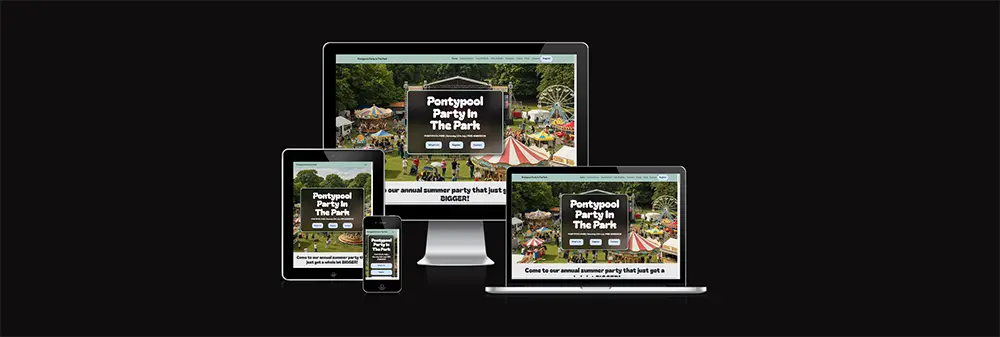

# Pontypool Party in The Park

## ABOUT

Pontypool Party in the Park is an annual event held for the benefit of the local community, the purpose of this website is to promote the event and encourage engagement with potential attendees through registration opportunities and social media facilities. The site has been designed and built to be responsive on all screen sizes and various modern devices and is screen-reader compatible, with the intention of being accessible to all user groups.

## CONTENTS

###  1. [User Experience (UX)](#user-experience-ux)
  * [Site Owner Goals](#site-owner-goals)
  * [User Stories](#user-stories)

### 2. [Website Design](#website-design)
  * [Colour palettes](#colour-palettes)
  * [Typography](#typography)
  * [Images](#images)
  * [Wireframe Designs](#wireframe-designs)

### 3. [Features](#features)
  * [Site Navigation](#site-navigation)
  * [Calls to Action](#calls-to-action)
  * [Social Engagement](#social-engagement)

### 4. [Technologies](#technologies)
  * [Coding Languages](#coding-languages)
  * [Google Fonts](#google-fonts)
  * [Font Awesome](#font-awesome)
  
### 5. [Libraries](#libraries)
  * [Bootstrap Libraries](#bootstrap-libraries)

### 6. [Testing](TESTING.md)
  * [User Stories](TESTING.md#user-stories)
  * [Main Home Page](TESTING.md#main-home-page-tests)
  * [Success Pages](TESTING.md#success-pages-tests)
  * [Validation](TESTING.md#validation)
  * [Lighthouse Reports](TESTING.md#lighthouse-reports)

### 7. [De-Bugging](#de-bugging)
  * [Developer Console Tools](#developer-console-tools)

### 8. [Deployment](#deployment)
  * [GitHub Pages](#github-pages)

### 9. [Credits](#credits)
  * [Code](#code)
  * [Content & Media](#content-and-media)

### 10. [Acknowledgements](#acknowledgements)

## USER EXPERIENCE (UX)

### Site Owner Goals

Pontypool Community Council are the intended site owners and will expect clarity, assurance and delivery of the following criteria:

  - [Return on investment](#return-on-investment)
  - [Audience perception](#audience-perception)
  - [Increased turnover and revenue](#increased-turnover-and-revenue)
  - [Increased engagement with target audiences & driving efficient conversion rates](#increased-engagement-with-target-audiences--driving-efficient-conversion-rates)
  - [Increased site traffic](#increased-site-traffic)
  - [Culturally-appropriate content](#culturally-appropriate-content)
  - [Relevance to the local community](#relevance-to-the-local-community)
  - [Intuitive presentation](#intuitive-presentation)
  - [Technology choices](#technology-choices)

  ### Return on investment

  Through researching prior iterations of the annual Pontypool Party in The Park events and exploring Council Committee meeting agenda minutes I've learned that the Pontypool Community Council (PCC) budget around £30k for this event - being the most expensive event in the local community calendar. The PCC currently host a single page to promote the event on their website (https://pontypoolcc.gov.uk/community-information/annual-events/party-in-the-park/) and I've found this iteration to be ineffective in attracting and incentivising attendance. It serves the purpose of presenting the event's existence, clarifies the event date and cost, and has a supporting image gallery and a link to social media, but does not serve to incentivise and motivate attendance and engagement with the event. There is a lack of call-to-action points and aside from the option of viewing further details on social media, there is no option for potential attendees to register their interest directly with the site organisers and be kept up-to-date on event news efficiently.
  
  By designing and implementing a new site page that acknowledges the current shortfalls and prioritises engagement with the local community and incentivises attendance, we can work to achieve the following goals:

  - Increased attendance/footfall at the event.
  - Increased levels of spending - improving the local economy and visibility of local small businesses.
  - Increased exposure to the local area and the social/commercial opportunities available.
  - Increased awareness of charitable causes.
  - Promotion of the local community unique to Pontypool, bolstering social cohesion and engagement.
  - Promotion of local initiatives and talents.
  - Generate sponsorship opportunities.

  ### Audience Perception

  To ensure site visitors are provided with crucially positive impressions of the event and are motivated to attend, this project will work towards achieving the following key goals:

  - The site content is fun, simplistic and engaging.
  - The site is attractive and motivational to a range of different cultural and social demographics and is positively inclusive.
  - The site uses modern design trends and is accessible to a wide range of screen sizes and device mediums.
  - The site offers interactivity that generates further engagement.
  - The site complies with all necessary ARIA accessibility requirements, including making use of semantic HTML elements, to aid compatibility with screen-reader technologies.

  ### Increased turnover and revenue

  Through identifying the criteria which are required to achieve the target of increased attendance and site-user conversion, I can reasonably speculate that increased footfall and attendance along with increased options for retail opportunities will all combine to promote spending at the event with event traders, including small businesses in the vicinity of the event not directly involved.

  ### Increased engagement with target audiences & driving efficient conversion rates

  By assessing the current shortfalls in engagement facilities within the current PCC event site and planning a suitable and progressive alternative facility that promotes engagement and drives site user conversion (by way of a registration form), I'm confident in achieving the site owner’s goals. Through the use of engaging, informative yet simple-to-assimilate information, and essential call-to-action points strategically placed intermittently throughout the page, this project site will encourage fruitful and useful site user engagement that will convert to tangible benefits for the event organisers, local community businesses and event attendees combined.

  ### Increased site traffic

  Through implementing efficient and validated HTML5 and CSS3 code that culminates in a well-designed site layout, which is functional and achieves all site user goals, I'm confident that site traffic will improve over the current standard. Efficient and validated code will support SEO ranking and accessibility for all user groups. Site validation will be achieved through the following tools:

  - W3C HTML Validation Service
  - W3C CSS Validation Service
  - Chrome Lighthouse Reports

  ### Culturally-appropriate content

  The proposed site will need to appeal to a diverse range of demographics that are identified through age, race, religion, gender and culture. The area of Pontypool is a relatively diverse environment with age groups across the spectrum, although there is a sizeable volume of retirement-age individuals present. There is a positive attitude towards socialising and due to economic constraints free events are always popular. Whilst I haven't identified any prominent religious groups in the vicinity, I'm aware of several local areas of worship, which implies a necessity to consider the cultural tone of the event and its promotion, ensuring sensitivity to all identifiable groups. 
  
  PCC also host an annual "Pride" event in the same location as Party in The Park and, through attendance last year, I learned of the importance of the LGBTQ+ community being recognised and treated with inclusivity and respect. Provided all content on the site is respectful and not discriminatory, promotes positivity and recognises the various demographics residing in the local area, I'm confident this approach to communication with the community will garner increased attendance and revenues, whilst fostering a positive environment and atmosphere.

  ### Relevance to the local community

  To ensure site visitors have a positive experience and gain a sense of familiarity with the event before attending, I need to pay particular attention to include relevant information that helps promote the local area and ultimately drive attendance. 

  - Images need to exhibit the Pontypool Park environment and atmosphere.
  - Copy needs to reflect the cultural and social nuances of the surrounding population.
  - Essential information needs to be factual, accessible and easy to digest.
  
  ### Intuitive presentation

  The site will need to be intuitive and designed around the common expectations of general website visitors. To achieve this I will:

  - Ensure the site layout is logical in order, prioritising the most essential information first
  - Provide a fixed navigation bar to support site users and avoid laborious scrolling and poor user experience
  - Include relevant image content to support neighbouring copy
  - Any sections of information that are considerable in size need to be presented using specific elements which have been designed to help condense information and present detail  effectively.

  ### Technology choices

  A core goal of this site is to make use of the HTML5 and CSS3 coding languages proficiently, to ensure a fully functioning and effective resource is available to potential event attendees. 
  
  - Using HTML5 along with Bootstrap library components will help achieve formatting and layout choices. 
  - CSS3 styling will help coordinate the aesthetic of the site, promote consistency and ensure compatibility with different screen sizes.
  - Relevant Font Awesome iconography will help users understand and engage with content contained within the site.
  - Interactive form elements will drive user engagement with the event and the organisers.
  - Embedded resources from Google Maps will help provide site users with a valuable tool, useful in promoting event attendance.

### User Stories

- #### As a site visitor and member of the local community ...

  - I need a user-friendly design that is responsive and laid out effectively, so I can easily find the core information I require to make an informed decision on attendance.

  - I need clear and attractive images along with written content to support said images which accurately depict the environment and atmosphere of the event, so I can make a qualified decision on attendance.

  - I need to be able to quickly and easily find important event information such as date, location and cost, to be able to decide on attendance.

  - I want to learn about the entertainment acts and food/gift stalls that will be available during the event, to help decide on attendance and whether the event is suitable.

  - I'd like to be able to register minimal details with the event organisers to ensure I am kept up to date on any news and incentives related to the event, before attendance.

  - I'd appreciate information that confirms the availability of toilets, handwashing facilities and health professionals to ensure our attendance at the event is comfortable and safe. This information will help determine the suitability to attend this event.

  - I would like to be able to see answers to common questions an event attendee may ask before deciding on attendance.

  - I would like reassurance that the event is a 'safe space' and inclusive for all cultural and social demographics, is non-discriminatory and has resources available to support me should I need advice.

  - I would like to know about which charities are being supported by the event and how I may be able to contribute, to help support important initiatives and positive change.

  - I would like to know about what opportunities are available to support the event in achieving its financial targets, with the goal of promoting my business and gaining traction in the local areas of commerce.

## WEBSITE DESIGN

### Colour Palettes

The subject of this site will be the main park in Pontypool and will need images that convey this location well. As the site will involve images of a natural park area I thought a colour palette that complimented the colours naturally found in a park would be useful for this project.

The colour palette would need to be soft and subtle to contrast the deeper colours shown in the images of the event. The colour palette I chose is shown in the image below:

### Typography

This site needs to be attractive to a wide range of site users due to the audience base this event will be intended for. The event is intended to be fun and family-friendly and this needs to be conveyed through the typography choices.

I chose a simple and easy-to-read font for the main bulk of the text content - the Google Font "Zain", and to give particular attention to certain titles I chose a more unique font - the Google Font "Bagel Fat One"

Examples of these fonts can be seen in the images below:

As a fallback to these font choices, I included "sans-serif" attributes to ensure a good user experience if the Google Font CDN ever fails. Throughout the site, I have made sure to follow semantic heading rules for all titles to ensure compliance with accessibility criteria and to follow best practices.

### Images

The main goal of this site is to attract potential attendees; to achieve this I have included plenty of supporting images that make specific reference to the location of the event, Pontypool Park. I've also referred to the key selling points of the event, like the entertainment and food and drink opportunities. Whilst this event is a real event I found that a lot of the imagery available online did not cover the variety of shots I needed to achieve the site goal so I used Google Gemini to create my images. 

I made sure to include prompts relating to the event and location, to try and create an honest impression of the event that was not too misleading, despite being A.I generated. For the future development of this website, I plan to attend this event and take a wide selection of photographs that can then be used to replace the A.I generated images and instead offer users a true reflection of this event.

All images have been provided with 'alt' attributes to assist with screen-reader technologies.

### Wireframe Designs

Due to the large target audience of site users, I need to make sure this site is simple to navigate and site users can quickly find the information they require to decide on attendance. Rather than create a complicated site structure with designated pages for the various sections and selling points of the site, I chose to have a single page that condensed the information into one space with multiple sections, ensuring site users are presented with all the information they need efficiently and with minimal page navigation required. 

By having a simple site structure the site will perform effectively as a platform to 'sell' the event to site users, as each section has been located to compound the value offered in the previous section, culminating in the opportunity to register as an event attendee and achieve another core function of the site. I have used semantic HTML elements where possible to help with accessibility and to follow best practices. 

Following the Registration section, if a site user is still undecided they have further supplemental event information available in the Travel, FAQs and Contact sections, which will hopefully alleviate any concerns or queries they may have and further encourage attendance. Finally, if a site user reaches the site footer and is still undecided I have included a basic site map that will navigate users to their chosen section.

I have included my initial wire-frame documents below:

  * [Mobile Wireframe](docs/mobilewireframe.pdf)
  * [Tablet Wireframe](docs/tabletwireframe.pdf)
  * [Desktop Wireframe](docs/desktopwireframe.pdf)

During development, I found several of my initial design elements were overly complicated to achieve, mainly the masonry image layout within the main Entertainment section. After exploring various ways of achieving the initial design I then decided to save time and use a more simplistic design for this section. Another change in the layout came with the volume of images intended to be used, as I found the site became too 'busy' and distracting, so the overall quantity of images has been reduced, particularly in the Food & Drink and Gifts & Stalls areas.

## FEATURES

A core goal of the site is user engagement with the event organisers via registering for event updates, but also through social media where site users can learn about the key selling points of the event, such as the entertainment and retail options. The site includes a simple and effective lead capture form requiring only first and last names, an email address for correspondence, and a distinction on what type of attendee the user is registering as. By including a drop-down element within the form and asking site users to make this declaration, it ensures data is accurate and that the correct marketing is received by the intended audience. The declaration of attendee type also benefits specifically performers and vendors, as they are more identifiable to the organisers and will be useful for future event planning purposes. 

When users successfully complete a form they are greeted with a confirmation message via redirection to a specific "Success" page. Within these confirmation pages, I've included necessary links for users to redirect back to the site home page, ensuring site users do not get lost. The confirmation pages also include the expected navigation and footer elements, to support consistency across the site structure but also to help users navigate effectively to their next destination within the site.

The site also includes a standard contact form to support site users with specific questions and queries, but this form also asks users to specify the context of their form submission, in relation to niche activities, like sponsorship or charity support. This addition to the form will support the user experience and help event organisers respond correctly and effectively to their intended audiences. In addition to these forms, I’ve included all relevant social media links to their respective pages, and any that were not available now link to the main social media provider home page.

As an added feature to support the user experience and encourage event attendance an IFrame containing a Google map of the event location is available in the Travel section, along with links to useful external travel planning facilities. 

### Site Navigation

The site employs a simple navigation structure that contains links to the main sections and areas of the home page. When viewed on smaller devices the main navigation bar will condense into a burger icon that displays a drop-down menu when activated. 

Through studying the Code Institute walkthrough project “Boardwalk Games” I was introduced to a small script of JS that causes the burger menu list to collapse when a link is activated, as the standard Bootstrap navbar code does not offer this function. I have included this script within this site to offer a more professional experience to site users than the standard Bootstrap code allows for.

### Calls To Action

Various CTAs (calls to action) intersect the core sections, prompting users who are ready to head straight to the Registration section. I chose to include several instances across the main site page to remind site visitors of a core function of the site and to help achieve the site owner's goal of increased audience engagement.

### Social Engagement

All performers and suppliers cards and tab panels include relevant social media links, to help site users engage with the key selling points of the event. By providing links to this added content it will help site visitors to make informed choices about the suitability of the event and whether to attend or not. Links to the event organiser's social media pages are also present where possible to support site user engagement with the event.

## TECHNOLOGIES

### Coding Languages

This site employs HTML5 coding throughout, with a supporting CSS3 style sheet to assist with design choices not possible through the sole use of the Bootstrap Libraries. To achieve responsivity across screen sizes I have included Media Queries within the style sheet where necessary. The CSS style sheet was also supported with auto-prefixing via the GitHub tool listed in the Credits section of this document.

### Google Fonts

The site fonts have been provided via Google Fonts, with fall-back attributes present.

### Font Awesome

To support the user experience I made use of various relevant Font Awesome icons, helping the user to visualise the subject matter they are viewing.

## LIBRARIES

### Bootstrap Libraries

I've made use of the current Bootstrap Library (5.3.3) to assist with layout, spacing and components within the site. Due to the volume of information in the Food & Drink and Gifts & Stalls areas, I chose to use the Tabs Bootstrap element. This made the user experience better when browsing all of the various details available on the supplier tab panels. I also made use of the Accordion Bootstrap element to help condense the content within the FAQs section, to again help create a positive site user experience.

## DE-BUGGING

### Developer Console Tools

When testing the site during and after development I made extensive use of the Developer Tools Console within my browser, helping to identify any unexpected outcomes to the code in place. One particular bug that came up involved the main Navbar element width extending beyond the width of the Body element. To be able to identify which section or element within the page code was causing the error I removed each section individually and refreshed the site to see if the problem was resolved. Eventually, I worked out that the error was coming from a section where I had removed the default padding attribute from certain Bootstrap elements via custom CSS. Once the instances of padding="0" were removed the site structure reverted to its original design. Another issue I found through testing is with the form width contained within the Registration section - the form does not correctly span the full width of the container despite using the "col-12" Bootstrap class. This will be explored and rectified through future development.

## DEPLOYMENT

This site was created using Visual Code Studio and deployed to GitHub pages. 

### GitHub Pages

To deploy this site please complete the following steps:

1. Whilst logged in to GitHub select the "Milestones-Project-1-P3" option from the repository list.
2. Select the "settings" link from the main navigation bar.
3. Select the "pages" link from the left side menu.
4. Under the "build & deployment" menu, within the "branch" menu, select "Deploy from branch".
5. Select "main" and "/root" options.
6. Select "save".
7. Once the project has deployed you will have the option to visit the site by selecting the URL at the top of the page.

## CREDITS

### Code

Within the index.html page at lines 1020 to 1040, and within the success pages at lines 178 to 198 I have included code taken from the Boardward Games walkthrough tutorial provided by Code Institute to ensure the navbar dropdown list performed as intended.

- [Bootstrap 5.3.3](https://getbootstrap.com/) - HTML layout and components.
- [Visual Studio Code](https://code.visualstudio.com/) - IDE for writing code and deployment.
- [GitHub Autoprefixer](https://autoprefixer.github.io) - assists with CSS browser compatibility.
- [Font Awesome](https://fontawesome.com/) - icon assets.
- [W3 Schools](https://www.w3schools.com/) - useful in finding ways to achieve CSS choices.
- [Google Fonts](https://fonts.google.com/) - fonts.
- [Google Maps](https://www.google.co.uk/maps/) - map.
- [Google Chrome](https://www.google.co.uk/chrome/) - Lighthouse reports.

### Content and Media

- [Balsamiq Wireframing](https://balsamiq.com/) - wireframe graphics.
- [Adobe Photoshop](https://www.adobe.com/uk/products/photoshop.html) - image formatting and export to WebP, colour palettes.
- [Google Gemini](https://gemini.google.com/) - content copy and image creation.

## ACKNOWLEDGEMENTS

- [Code Insititute](https://codeinstitute.net/) - Course provider
- David Bowers - Mentor
