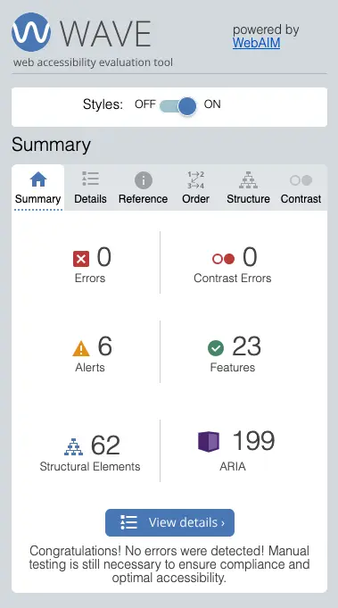

## TESTING

During the development process, I made sure to refer back to my user stories and owner goals, ensuring the purpose of the site was in focus at all times. I made sure to review user stories and ensure any supporting facilities in place, such as anchor links and form submission buttons were all functioning as intended. Several friends and family members were invited to test the site and no issues were raised, except for preferences around the colour palette, which were taken into consideration. 

When testing the forms all performed as expected during desktop device testing, however when testing on mobile devices using the Firefox browser the form does not prompt users to enter their details when submitting an empty form. Whilst the form does not submit with empty fields as intended, the issue of not prompting the user formally to complete all fields will be addressed in future development.

Browser compatibility tests were carried out using the following web browsers and showed no issues or errors:

- Chrome
- Firefox
- Safari
- DuckDuckGo

I also tested on the following devices to ensure responsivity was good:

- Desktop PC
- Macbook Pro
- Samsung A52s mobile device
- Samsung Galaxy Fold3 mobile/tablet device

When assessing the site against formal criteria I have achieved the following results detailed in the tables below:

 - Return to main [README.md](README.md)

### User Stories

| User Story                                                                                                                                                                                                                                                      | Aim                                                                                                                                                                                                                                                                                                        | Outcome                                                                                                                                                                                                                                                                                                                   | Result                                              |
| --------------------------------------------------------------------------------------------------------------------------------------------------------------------------------------------------------------------------------------------------------------- | ---------------------------------------------------------------------------------------------------------------------------------------------------------------------------------------------------------------------------------------------------------------------------------------------------------- | ------------------------------------------------------------------------------------------------------------------------------------------------------------------------------------------------------------------------------------------------------------------------------------------------------------------------- | --------------------------------------------------- |
| I need a user-friendly design that is responsive and laid out effectively, so I can easily find the core information I require to make an informed decision on attendance.                                                                                      | Website is responsive and laid out intuitively, with core information presented as a priority.                                                                                                                                                                                                             | On loading the site, the pages are responsive to all screen sizes and vital information about the event is presented in the first Hero section. Subsequent sections follow a priority based on what aspects of the event would draw in attendees most, being Entertainment, then Food & Drink, then Gifts and Stalls etc. | PASS                                                |
| I need clear and attractive images along with written content to support said images which accurately depict the environment and atmosphere of the event, so I can make a qualified decision on attendance.                                                     | Images are reflective of the event and relevant sections/areas include supporting text to accompany images.                                                                                                                                                                                                | All images relate directly to their location on the site and their accompanying text. Images have been produced to be high quality whilst using appropriate compression via the WebP file format to help with loading times.                                                                                              | PASS                                                |
| I need to be able to quickly and easily find important event information such as date, location and cost, to be able to decide on attendance.                                                                                                                   | Important event information is presented immediately upon site load, and is supported with an intuitive navigation bar that is fixed, helping users access important information within the 3-click rule.                                                                                                  | Main Hero section contains important event information and is the first section presented to site users. The navigation bar is fixed and allows users to browse to key areas on the page with ease.                                                                                                                       | PASS                                                |
| I want to learn about the entertainment acts and food / gift stalls that will be available during the event, to help decide on attendance and whether the event is suitable.                                                                                    | Motivational text and image content regarding Entertainment and Food & Drink / Gifts & Stalls are included in specific sections, linked to by the main navbar.                                                                                                                                             | Entertainment and Food & Drink / Gifts & Stalls sections are present and supported with attractive images and relevant text. Links to performer / supplier email and social media are also present to provide users with further information about these core aspects of the event.                                       | PASS                                                |
| I'd like to be able to register minimal details with the event organisers to ensure I am kept up to date on any news and incentives related to the event, before attendance.                                                                                    | Registration section is included and only requires basic information, such as name, email address and attendee type. All fields in this form are required for consistency of data capture. Upon submission site users are greeted with a Success page confirming a successful submission of their details. | Registration form contains only First Name, Last Name, Email and Attendee type fields, all are required, and user is redirected to Success page upon successful submission.                                                                                                                                               | PASS                                                |
| I'd appreciate information that confirms the availability of toilets, handwashing facilities and health professionals to ensure our attendance at the event is comfortable and safe. This information will help determine the suitability to attend this event. | Facilities section is included, comprising of motivational text and image content that relates to the subjects discusses in this section, reassuring site users of the event's comfort and safety provisions.                                                                                              | Facilities section is present and supported with attractive images and motivational text, providing necessary reassurances to site users.                                                                                                                                                                                 | PASS                                                |
| I would like to be able to see answers to common questions an event attendee may ask before deciding on attendance.                                                                                                                                             | FAQs section is included, comprising of descriptive and reassuring text content that addresses common queries and concerns potential event attendees may have.                                                                                                                                             | FAQ section is present and includes necessary text content to support and reassure potential attendees of queries and concerns they may have.                                                                                                                                                                             | PASS                                                |
| I would like reassurance that the event is a 'safe space' and inclusive for all cultural and social demographics, is non-discriminatory and has resources available to support me should I need advice.                                                         | Information is provided that promotes the event's inclusive attitude and reassures potential attendees of resources and support available at the event.                                                                                                                                                    | An Inclusivity panel is present within the FAQs section, providing the reassurance site users are looking for and also detailing resources and support available at the event.                                                                                                                                            | PASS                                                |
| I would like to know about which charities are being supported by the event and how I may be able to contribute, to help support important initiatives and positive change.                                                                                     | Information is provided that details the charity support offered by the event and explains how event attendees can offer their own support.                                                                                                                                                                | A Charities panel is present within the FAQs section, offering details on how the event supports local charities and offers information for event attendees to offer their own support.                                                                                                                                   | PASS (\* specific charities were not referenced) |
| I would like to know about what opportunities there are available to support the event in achieving it's financial targets, with the goal of promoting my business and gaining traction in the local areas of commerce.                                         | Information is provided that details and promotes the opportunities available for businesses to offer sponsorship to the event.                                                                                                                                                                            | A Sponsorship panel is present within the FAQs section, offering details and incentives for businesses to offer sponsorship to the event.                                                                                                                                                                                 | PASS                                                |

### Main Home Page Tests

#### NAVBAR

| Location / Feature | Aim                                                         | Test                    | Outcome                            | Result |
| ------------------ | ----------------------------------------------------------- | ----------------------- | ---------------------------------- | ------ |
| Navbar             | Site title redirects users to Home page                     | Tap site title          | Navigates to Home page             | PASS   |
|                    | HOME link redirects users to Hero section                   | Tap HOME link           | Navigates to Hero section          | PASS   |
|                    | ENTERTAINMENT link redirects users to Entertainment section | Tap ENTERTAINMENT link  | Navigates to Entertainment section | PASS   |
|                    | FOOD & DRINK link redirects users to Food & Drink area      | Tap FOOD & DRINK link   | Navigates to Food & Drink area     | PASS   |
|                    | GIFTS & STALLS link redirects users to Gifts & Stalls area  | Tap GIFTS & STALLS link | Navigates to Gifts & Stalls area   | PASS   |
|                    | FACILITIES link redirects users to Facilities section       | Tap FACILITIES link     | Navigates to Facilities section    | PASS   |
|                    | TRAVEL link redirects users to Travel section               | Tap FACILITIES link     | Navigates to Travel section        | PASS   |
|                    | FAQs link redirects users to FAQs area                      | Tap FAQs link           | Navigates to FAQs area             | PASS   |
|                    | CONTACT link redirects users to Contact Us area             | Tap CONTACT link        | Navigates to Contact Us area       | PASS   |
|                    | REGISTER button redirects users to Registration section     | Tap REGISTER button     | Navigates to Registration section  | PASS   |  

#### HERO Section  

| Location / Feature | Aim                                                       | Test                 | Outcome                            | Result |
| ------------------ | --------------------------------------------------------- | -------------------- | ---------------------------------- | ------ |
| Hero Section       | WHAT'S ON button redirects users to Entertainment section | Tap WHAT'S ON button | Navigates to Entertainment section | PASS   |
|                    | REGISTER button redirects users to Registration section   | Tap REGISTER button  | Navigates to Registration section  | PASS   |
|                    | CONTACT button redirects users to Contact area            | Tap CONTACT button   | Navigates to Contact area          | PASS   |

#### INTRO Section  

| Location / Feature | Aim                                                                         | Test                                  | Outcome                             | Result |
| ------------------ | --------------------------------------------------------------------------- | ------------------------------------- | ----------------------------------- | ------ |
| Intro Section      | EXPLORE OUR ENTERTAINMENT button redirects users to Entertainment section   | Tap EXPLORE OUR ENTERTAINMENT button  | Navigates to Entertainment section  | PASS   |
|                    | EXPLORE OUR FOOD & DRINK button redirects users to Food & Drink section     | Tap EXPLORE OUR FOOD & DRINK button   | Navigates to Food & Drink section   | PASS   |
|                    | EXPLORE OUR GIFTS & STALLS button redirects users to Gifts & Stalls section | Tap EXPLORE OUR GIFTS & STALLS button | Navigates to Gifts & Stalls section | PASS   |
|                    | EXPLORE OUR FACILITIES button redirects users to Facilities section         | Tap FACILITIES button                 | Navigates to Facilities section     | PASS   |  

#### CTA - Social Media

| Location / Feature | Aim                                                              | Test               | Outcome                                                | Result |
| ------------------ | ---------------------------------------------------------------- | ------------------ | ------------------------------------------------------ | ------ |
| CTA - Social Media | Facebook Icon links to organiser's Facebook page in separate tab | Tap Facebook Icon  | Navigates to organiser's Facebook page in separate tab | PASS   |
|                    | Twitter/X Icon links to Twitter/X page in separate tab           | Tap Twitter/X Icon | Navigates to Twitter/X page in separate tab            | PASS   |
|                    | Instagram Icon links to Instagram page in separate tab           | Tap Instagram Icon | Navigates to Instagram page in separate tab            | PASS   |

#### ENTERTAINMENT Section  

| Location / Feature    | Aim                                                                                    | Test               | Outcome                                                 | Result |
| --------------------- | -------------------------------------------------------------------------------------- | ------------------ | ------------------------------------------------------- | ------ |
| Entertainment Section | GLC Card Facebook Icon links to performer's Facebook page in separate tab              | Tap Facebook Icon  | Navigates to performer's Facebook page in separate tab  | PASS   |
|                       | GLC Card Twitter/X Icon links to performer's Twitter/X page in separate tab            | Tap Twitter/X Icon | Navigates to performer's Twitter/X page in separate tab | PASS   |
|                       | GLC Card Instagram Icon links to performer's Instagram page in separate tab            | Tap Instagram Icon | Navigates to performer's Instagram page in separate tab | PASS   |
|                       | GLC Card YouTube Icon links to performer's YouTube page in separate tab                | Tap YouTube Icon   | Navigates to performer's YouTube page in separate tab   | PASS   |
|                       |                                                                                        |                    |                                                         |        |
|                       | Stereophonics Card Facebook Icon links to performer's Facebook page in separate tab    | Tap Facebook Icon  | Navigates to performer's Facebook page in separate tab  | PASS   |
|                       | Stereophonics Card Twitter/X Icon links to performer's Twitter/X page in separate tab  | Tap Twitter/X Icon | Navigates to performer's Twitter/X page in separate tab | PASS   |
|                       | Stereophonics Card Instagram Icon links to performer's Instagram page in separate tab  | Tap Instagram Icon | Navigates to performer's Instagram page in separate tab | PASS   |
|                       | Stereophonics Card YouTube Icon links to performer's YouTube page in separate tab      | Tap YouTube Icon   | Navigates to performer's YouTube page in separate tab   | PASS   |
|                       |                                                                                        |                    |                                                         |        |
|                       | Cerys Matthews Card Facebook Icon links to performer's Facebook page in separate tab   | Tap Facebook Icon  | Navigates to performer's Facebook page in separate tab  | PASS   |
|                       | Cerys Matthews Card Twitter/X Icon links to performer's Twitter/X page in separate tab | Tap Twitter/X Icon | Navigates to performer's Twitter/X page in separate tab | PASS   |
|                       | Cerys Matthews Card Instagram Icon links to performer's Instagram page in separate tab | Tap Instagram Icon | Navigates to performer's Instagram page in separate tab | PASS   |
|                       | Cerys Matthews Card YouTube Icon links to performer's YouTube page in separate tab     | Tap YouTube Icon   | Navigates to performer's YouTube page in separate tab   | PASS   |
|                       |                                                                                        |                    |                                                         |        |
|                       | Ruth Jones Card Facebook Icon links to performer's Facebook page in separate tab       | Tap Facebook Icon  | Navigates to performer's Facebook page in separate tab  | PASS   |
|                       | Ruth Jones Card Twitter/X Icon links to performer's Twitter/X page in separate tab     | Tap Twitter/X Icon | Navigates to performer's Twitter/X page in separate tab | PASS   |
|                       | Ruth Jones Card Instagram Icon links to performer's Instagram page in separate tab     | Tap Instagram Icon | Navigates to performer's Instagram page in separate tab | PASS   |

#### CTA - Register as attendee

| Location / Feature         | Aim                                                     | Test                | Outcome                           | Result |
| -------------------------- | ------------------------------------------------------- | ------------------- | --------------------------------- | ------ |
| CTA - Register as attendee | REGISTER button redirects users to Registration section | Tap REGISTER button | Navigates to Registration section | PASS   |

#### FOOD & DRINK Area

| Location / Feature   | Aim                                                                                 | Test                     | Outcome                                               | Result |
| -------------------- | ----------------------------------------------------------------------------------- | ------------------------ | ----------------------------------------------------- | ------ |
| Food & Drink Area    | Ponty Pies tab opens Ponty Pies tab panel                                           | Tap Ponty Pies tab       | Opens Ponty Pies tab panel                            | PASS   |
|                      | Ponty Pies Tab Email Icon opens new email message window                            | Tap Email Icon           | Opens new email message window                        | PASS   |
|                      | Ponty Pies Tab Facebook Icon links to supplier's Facebook page in separate tab      | Tap Facebook Icon        | Navigates to supplier's Facebook page in separate tab | PASS   |
|                      | Ponty Pies Tab Twitter/X Icon links to Twitter/X in separate tab                    | Tap Twitter/X Icon       | Navigates to Twitter/X in separate tab                | PASS   |
|                      | Ponty Pies Tab Instagram Icon links to Instagram in separate tab                    | Tap Instagram Icon       | Navigates to Instagram in separate tab                | PASS   |
|                      | Ponty Pies Tab YouTube Icon links to YouTube in separate tab                        | Tap YouTube Icon         | Navigates to YouTube in separate tab                  | PASS   |
|                      | Ponty Pies DOWNLOAD MENU button opens supplier menu in separate tab                 | Tap DOWNLOAD MENU button | Opens supplier menu in separate tab                   | PASS   |
|                      |                                                                                     |                          |                                                       |        |
|                      | Bangin' Burgers tab opens Bangin' Burgers tab panel                                 | Tap Bangin' Burgers tab  | Opens Bangin' Burgers tab panel                       | PASS   |
|                      | Bangin' Burgers Tab Email Icon opens new email message window                       | Tap Email Icon           | Opens new email message window                        | PASS   |
|                      | Bangin' Burgers Tab Facebook Icon links to supplier's Facebook page in separate tab | Tap Facebook Icon        | Navigates to supplier's Facebook page in separate tab | PASS   |
|                      | Bangin' Burgers Tab Twitter/X Icon links to Twitter/X in separate tab               | Tap Twitter/X Icon       | Navigates to Twitter/X in separate tab                | PASS   |
|                      | Bangin' Burgers Tab Instagram Icon links to Instagram in separate tab               | Tap Instagram Icon       | Navigates to Instagram in separate tab                | PASS   |
|                      | Bangin' Burgers Tab YouTube Icon links to YouTube in separate tab                   | Tap YouTube Icon         | Navigates to YouTube in separate tab                  | PASS   |
|                      | Bangin' Burgers DOWNLOAD MENU button opens supplier menu in separate tab            | Tap DOWNLOAD MENU button | Opens supplier menu in separate tab                   | PASS   |
|                      |                                                                                     |                          |                                                       |        |
|                      | Cheers Beers tab opens Cheers Beers tab panel                                       | Tap Cheers Beers tab     | Opens Cheers Beers tab panel                          | PASS   |
|                      | Cheers Beers Tab Email Icon opens new email message window                          | Tap Email Icon           | Opens new email message window                        | PASS   |
|                      | Cheers Beers Tab Facebook Icon links to supplier's Facebook page in separate tab    | Tap Facebook Icon        | Navigates to supplier's Facebook page in separate tab | PASS   |
|                      | Cheers Beers Tab Twitter/X Icon links to Twitter/X in separate tab                  | Tap Twitter/X Icon       | Navigates to Twitter/X in separate tab                | PASS   |
|                      | Cheers Beers Tab Instagram Icon links to Instagram in separate tab                  | Tap Instagram Icon       | Navigates to Instagram in separate tab                | PASS   |
|                      | Cheers Beers Tab YouTube Icon links to YouTube in separate tab                      | Tap YouTube Icon         | Navigates to YouTube in separate tab                  | PASS   |
|                      | Cheers Beers DOWNLOAD MENU button opens supplier menu in separate tab               | Tap DOWNLOAD MENU button | Opens supplier menu in separate tab                   | PASS   |

#### GIFTS & STALLS Area

| Location / Feature     | Aim                                                                                | Test                   | Outcome                                               | Result |
| ---------------------- | ---------------------------------------------------------------------------------- | ---------------------- | ----------------------------------------------------- | ------ |
| Gifts & Stalls Area    | Gorgeous Gifts tab opens Gorgeous Gifts tab panel                                  | Tap Gorgeous Gifts tab | Opens Gorgeous Gifts tab panel                        | PASS   |
|                        | Gorgeous Gifts Tab Email Icon opens new email message window                       | Tap Email Icon         | Opens new email message window                        | PASS   |
|                        | Gorgeous Gifts Tab Facebook Icon links to supplier's Facebook page in separate tab | Tap Facebook Icon      | Navigates to supplier's Facebook page in separate tab | PASS   |
|                        | Gorgeous Gifts Tab Twitter/X Icon links to Twitter/X in separate tab               | Tap Twitter/X Icon     | Navigates to Twitter/X in separate tab                | PASS   |
|                        | Gorgeous Gifts Tab Instagram Icon links to Instagram in separate tab               | Tap Instagram Icon     | Navigates to Instagram in separate tab                | PASS   |
|                        | Gorgeous Gifts Tab YouTube Icon links to YouTube in separate tab                   | Tap YouTube Icon       | Navigates to YouTube in separate tab                  | PASS   |
|                        |                                                                                    |                        |                                                       |        |
|                        | LLL at Home tab opens LLL at Home tab panel                                        | Tap LLL at Home tab    | Opens LLL at Home tab panel                           | PASS   |
|                        | LLL at Home Tab Email Icon opens new email message window                          | Tap Email Icon         | Opens new email message window                        | PASS   |
|                        | LLL at Home Tab Facebook Icon links to supplier's Facebook page in separate tab    | Tap Facebook Icon      | Navigates to supplier's Facebook page in separate tab | PASS   |
|                        | LLL at Home Tab Twitter/X Icon links to Twitter/X in separate tab                  | Tap Twitter/X Icon     | Navigates to Twitter/X in separate tab                | PASS   |
|                        | LLL at Home Tab Instagram Icon links to Instagram in separate tab                  | Tap Instagram Icon     | Navigates to Instagram in separate tab                | PASS   |
|                        | LLL at Home Tab YouTube Icon links to YouTube in separate tab                      | Tap YouTube Icon       | Navigates to YouTube in separate tab                  | PASS   |
|                        |                                                                                    |                        |                                                       |        |
|                        | Noam's Garden tab opens Noam's Garden tab panel                                    | Tap Noam's Garden tab  | Opens Noam's Garden tab panel                         | PASS   |
|                        | Noam's Garden Tab Email Icon opens new email message window                        | Tap Email Icon         | Opens new email message window                        | PASS   |
|                        | Noam's Garden Tab Facebook Icon links to supplier's Facebook page in separate tab  | Tap Facebook Icon      | Navigates to supplier's Facebook page in separate tab | PASS   |
|                        | Noam's Garden Tab Twitter/X Icon links to Twitter/X in separate tab                | Tap Twitter/X Icon     | Navigates to Twitter/X in separate tab                | PASS   |
|                        | Noam's Garden Tab Instagram Icon links to Instagram in separate tab                | Tap Instagram Icon     | Navigates to Instagram in separate tab                | PASS   |
|                        | Noam's Garden Tab YouTube Icon links to YouTube in separate tab                    | Tap YouTube Icon       | Navigates to YouTube in separate tab                  | PASS   |

#### CTA - Register as supplier

| Location / Feature         | Aim                                                     | Test                | Outcome                           | Result |
| -------------------------- | ------------------------------------------------------- | ------------------- | --------------------------------- | ------ |
| CTA - Register as supplier | REGISTER button redirects users to Registration section | Tap REGISTER button | Navigates to Registration section | PASS   |

#### REGISTRATION Form

| Location / Feature | Aim                                                                | Test                                  | Outcome                                      | Result |
| ------------------ | ------------------------------------------------------------------ | ------------------------------------- | -------------------------------------------- | ------ |
| Registration Form  | First Name field is required and expects text content              | Submit form without First Name        | Form does not submit                         | PASS   |
|                    | Last Name field is required and expects text content               | Submit form without Last Name         | Form does not submit                         | PASS   |
|                    | Email address field is requried and expects email content          | Submit form without Email             | Form does not submit                         | PASS   |
|                    |                                                                    | Submit form without @ symbol          | Form does not submit                         | PASS   |
|                    | Register As field is required and expects an option to be selected | Submit form without selecting option  | Form does not submit                         | PASS   |
|                    | Completed form redirects user to Success page                      | Submit form will all fields completed | Form submits, redirects user to Success page | PASS   |

#### TRAVEL Section

| Location / Feature | Aim                                                                                              | Test                                          | Outcome                                                | Result |
| ------------------ | ------------------------------------------------------------------------------------------------ | --------------------------------------------- | ------------------------------------------------------ | ------ |
| Travel Section     | "Route Plan with Google Maps" link opens Google Maps route planner in separate tab               | Tab "Route Plan with Google Maps" link        | Opens Google Maps route planner in separate tab        | PASS   |
|                    | "Route Plan with Stagecoach Torfaen" link opens Stagecoach Torfaen route planner in separate tab | Tab "Route Plan with Stagecoach Torfaen" link | Opens Stagecoach Torfaen route planner in separate tab | PASS   |
|                    | "Route Plan with The Trainline" link opens The Trainline route planner in separate tab           | Tab "Route Plan with The Trainline" link      | Opens The Trainline route planner in separate tab      | PASS   |

#### FAQs Area

| Location / Feature | Aim                                                              | Test                     | Outcome                                                | Result |
| ------------------ | ---------------------------------------------------------------- | ------------------------ | ------------------------------------------------------ | ------ |
| FAQs area          | ACCESSIBILITY accordion item opens Accessibility panel           | Tab ACCESSIBILITY item   | Opens Accessibility panel                              | PASS   |
|                    | INCLUSIVITY accordion item opens Inclusivity panel               | Tab INCLUSIVITY item     | Opens Inclusivity panel                                | PASS   |
|                    | NEURODIVERGENCE accordion item opens Neurodivergence panel       | Tab NEURODIVERGENCE item | Opens Neurodivergence panel                            | PASS   |
|                    | CHILDREN'S ZONE accordion item opens Children's Zone panel       | Tab CHILDREN'S ZONE item | Opens Children's Zone panel                            | PASS   |
|                    | CHARITY SUPPORT accordion item opens Charity Support panel       | Tab CHARITY SUPPORT item | Opens Charity Support panel                            | PASS   |
|                    | SPONSORSHIP accordion item opens Sponsorship panel               | Tab SPONSORSHIP item     | Opens Sponsorship panel                                | PASS   |
|                    |                                                                  |                          |                                                        |        |
|                    | Facebook Icon links to organiser's Facebook page in separate tab | Tap Facebook Icon        | Navigates to organiser's Facebook page in separate tab | PASS   |
|                    | Twitter/X Icon links to Twitter/X page in separate tab           | Tap Twitter/X Icon       | Navigates to Twitter/X page in separate tab            | PASS   |
|                    | Instagram Icon links to Instagram page in separate tab           | Tap Instagram Icon       | Navigates to Instagram page in separate tab            | PASS   |

#### CONTACT US Area

| Location / Feature | Aim                                                                 | Test                                  | Outcome                                      | Result |
| ------------------ | ------------------------------------------------------------------- | ------------------------------------- | -------------------------------------------- | ------ |
| Contact Form       | First Name field is required and expects text content               | Submit form without First Name        | Form does not submit                         | PASS   |
|                    | Last Name field is required and expects text content                | Submit form without Last Name         | Form does not submit                         | PASS   |
|                    | Email address field is requried and expects email content           | Submit form without Email             | Form does not submit                         | PASS   |
|                    |                                                                     | Submit form without @ symbol          | Form does not submit                         | PASS   |
|                    | Enquiry Type field is required and expects an option to be selected | Submit form without selecting option  | Form does not submit                         | PASS   |
|                    | Leave a message here field is required and expects text content     | Submit form without Message entry     | Form does not submit                         | PASS   |
|                    | Completed form redirects user to Success page                       | Submit form with all fields completed | Form submits, redirects user to Success page | PASS   |

#### FOOTER Section

| Location / Feature | Aim                                                                        | Test                                 | Outcome                                              | Result |
| ------------------ | -------------------------------------------------------------------------- | ------------------------------------ | ---------------------------------------------------- | ------ |
| Footer             | Telephone number link opens new phonecall window with number pre-populated | Tap Telephone number                 | Opens new phonecall window with number pre-populated | PASS   |
|                    | HOME anchor link re-directs to top Hero section                            | Tap HOME link                        | Redirects to top Hero section                        | PASS   |
|                    | ENTERTAINMENT anchor link re-directs to Entertainment section              | Tap ENTERTAINMENT link               | Redirects to Entertainment section                   | PASS   |
|                    | FOOD & DRINK anchor link re-directs to Food & Drink area                   | Tap FOOD & DRINK link                | Redirects to Food & Drink area                       | PASS   |
|                    | GIFTS & STALLS anchor link re-directs to Gifts & Stalls area               | Tap GIFTS & STALLS link              | Redirects to Gifts & Stalls area                     | PASS   |
|                    | FACILITIES anchor link re-directs to Facilities section                    | Tap FACILITIES link                  | Redirects to Facilities section                      | PASS   |
|                    | REGISTER anchor link re-directs to Registration section                    | Tap REGISTER link                    | Redirects to Registration section                    | PASS   |
|                    | TRAVEL anchor link re-directs to Travel section                            | Tap TRAVEL link                      | Redirects to Travel section                          | PASS   |
|                    | FAQS anchor link re-directs to FAQs area                                   | Tap FAQs link                        | Redirects to FAQs area                               | PASS   |
|                    | CONTACT anchor link re-directs to Contact Us area                          | Tap CONTACT link                     | Redirects to Contact Us area                         | PASS   |
|                    |                                                                            |                                      |                                                      |        |
|                    | "Download Poster" button links to Poster doc in separate tab               | Tab "Download Poster"                | Opens Poster doc in separate tab                     | PASS   |
|                    | "Download Flyer" button links to Flyer doc in separate tab                 | Tab "Download Flyer"                 | Opens Flyer doc in separate tab                      | PASS   |
|                    | "Download Event Map" button links to Event Map doc in separate tab         | Tab "Download Event Map"             | Opens Event Map doc in separate tab                  | PASS   |
|                    |                                                                            |                                      |                                                      |        |
|                    | Pontypool Community Council logo opens PCC website in separate tab         | Tap Pontypool Community Council logo | Opens PCC website in separate tab                    | PASS   |
|                    | Torfaen Borough Council logo opens TBC website in separate tab             | Tap Torfaen Borough Council logo     | Opens TBC website in separate tab                    | PASS   |

### Success Pages Tests

#### NAVBAR

| Location / Feature | Aim                                                                    | Test                    | Outcome                                       | Result |
| ------------------ | ---------------------------------------------------------------------- | ----------------------- | --------------------------------------------- | ------ |
| Navbar Links       | Site title redirects users to home page                                | Tap site title          | Navigates to home page                        | PASS   |
|                    | HOME link redirects users to Home page, Hero section                   | Tap HOME link           | Navigates to Home page, Hero section          | PASS   |
|                    | ENTERTAINMENT link redirects users to Home page, Entertainment section | Tap ENTERTAINMENT link  | Navigates to Home page, Entertainment section | PASS   |
|                    | FOOD & DRINK link redirects users to Home page, Food & Drink area      | Tap FOOD & DRINK link   | Navigates to Home page, Food & Drink area     | PASS   |
|                    | GIFTS & STALLS link redirects users to Home page, Gifts & Stalls area  | Tap GIFTS & STALLS link | Navigates to Home page, Gifts & Stalls area   | PASS   |
|                    | FACILITIES link redirects users to Home page, Facilities section       | Tap FACILITIES link     | Navigates to Home page, Facilities section    | PASS   |
|                    | TRAVEL link redirects users to Home page, Travel section               | Tap FACILITIES link     | Navigates to Home page, Travel section        | PASS   |
|                    | FAQs link redirects users to Home page, FAQs area                      | Tap FAQs link           | Navigates to Home page, FAQs area             | PASS   |
|                    | CONTACT link redirects users to Home page, Contact Us area             | Tap CONTACT link        | Navigates to Home page, Contact Us area       | PASS   |
|                    | REGISTER button redirects users to Home page, Registration section     | Tap REGISTER button     | Navigates to Home page, Registration section  | PASS   |

#### MAIN Section

| Location / Feature | Aim                                                           | Test                      | Outcome                      | Result |
| ------------------ | ------------------------------------------------------------- | ------------------------- | ---------------------------- | ------ |
| Main Section       | "Return to the home page" button redirects users to Home page | Tab "Return to home page" | Redirects users to Home page | PASS   |

#### FOOTER Section

| Location / Feature | Aim                                                                        | Test                                 | Outcome                                              | Result |
| ------------------ | -------------------------------------------------------------------------- | ------------------------------------ | ---------------------------------------------------- | ------ |
| Footer             | Telephone number link opens new phonecall window with number pre-populated | Tap Telephone number                 | Opens new phonecall window with number pre-populated | PASS   |
|                    | HOME anchor link re-directs to Home page, top Hero section                 | Tap HOME link                        | Redirects to Home page, top Hero section             | PASS   |
|                    | ENTERTAINMENT anchor link re-directs to Home page, Entertainment section   | Tap ENTERTAINMENT link               | Redirects to Home page, Entertainment section        | PASS   |
|                    | FOOD & DRINK anchor link re-directs to Home page, Food & Drink area        | Tap FOOD & DRINK link                | Redirects to Home page, Food & Drink area            | PASS   |
|                    | GIFTS & STALLS anchor link re-directs to Home page, Gifts & Stalls area    | Tap GIFTS & STALLS link              | Redirects to Home page, Gifts & Stalls area          | PASS   |
|                    | FACILITIES anchor link re-directs to Home page, Facilities section         | Tap FACILITIES link                  | Redirects to Home page, Facilities section           | PASS   |
|                    | REGISTER anchor link re-directs to Home page, Registration section         | Tap REGISTER link                    | Redirects to Home page, Registration section         | PASS   |
|                    | TRAVEL anchor link re-directs to Home page, Travel section                 | Tap TRAVEL link                      | Redirects to Home page, Travel section               | PASS   |
|                    | FAQS anchor link re-directs to Home page, FAQs area                        | Tap FAQs link                        | Redirects to Home page, FAQs area                    | PASS   |
|                    | CONTACT anchor link re-directs to Home page, Contact Us area               | Tap CONTACT link                     | Redirects to Home page, Contact Us area              | PASS   |
|                    |                                                                            |                                      |                                                      |        |
|                    | "Download Poster" button links to Poster doc in separate tab               | Tab "Download Poster"                | Opens Poster doc in separate tab                     | PASS   |
|                    | "Download Flyer" button links to Flyer doc in separate tab                 | Tab "Download Flyer"                 | Opens Flyer doc in separate tab                      | PASS   |
|                    | "Download Event Map" button links to Event Map doc in separate tab         | Tab "Download Event Map"             | Opens Event Map doc in separate tab                  | PASS   |
|                    |                                                                            |                                      |                                                      |        |
|                    | Pontypool Community Council logo opens PCC website in separate tab         | Tap Pontypool Community Council logo | Opens PCC website in separate tab                    | PASS   |
|                    | Torfaen Borough Council logo opens TBC website in separate tab             | Tap Torfaen Borough Council logo     | Opens TBC website in separate tab                    | PASS   |

### Validation

All site pages have been validated using the [https://validator.w3.org/](https://validator.w3.org/) tool. During initial testing, I found that using multiple Bootstrap assets had created errors in the overall code by duplicating certain element IDs. To fix this I made sure to update any offending duplicates. Several small errors in code syntax were also remedied and now the site HTML code shows no errors.

The CSS style sheet has been validated using the [https://jigsaw.w3.org/css-validator/](https://jigsaw.w3.org/css-validator/) tool and no errors were found.

For accessibility purposes and to support screen-readers I used a WAVE Evaluation Tool browser plugin provided by [WebAIM](https://webaim.org/) to evaluate the site for aria-compliance. Initial tests showed several errors relating to the aria-labelling of icons and semantic heading ordering. Following the use of this tool, I identified the accessibility errors and all have been corrected. There are currently six alerts relating to PDF documents available on the site. Aria labels were added but this did not fix the issue, as it relates to screen-reader compatibility with the pdf file type. Future development of this site will look to address this area.

### Lighthouse Reports

During initial Lighthouse Report testing, I received low scores relating to the previous issue of missing aria labels and also in relation to performance. To fix the accessibility issues all aria-labelling errors were corrected using the WebAIM tool. To improve performance I chose to export new versions of my images, reducing their sizes by 50%. The images had originally been exported via Adobe Photoshop in WebP format at a 74% level of quality to ensure optimum loading times along with maintaining a high-quality image. The original exports proved to be excessively large for their intended placements and by reducing their sizes to more reasonable values I helped to improve the performance and loading times of the site. 

The main hero image was also rather large at around 900kb; so to improve performance with this section I reduced the file size but also created versions for alternative screen sizes. I maintained the aspect ratio of the original Hero background image but scaled down the size to suit tablets and mobile devices. Using Media Queries in my CSS style sheet I made sure the relevant size Hero image was loaded depending on what size screen is viewing the site, helping again to improve the Lighthouse Report scores. The desktop scores are positive, however future development will require a focus on improving mobile device scores.

The final LightHouse Report scores are shown below:
#### Desktop Lighthouse Report Score

#### Mobile Lighthouse Report Score

 - Return to main [README.md](README.md)